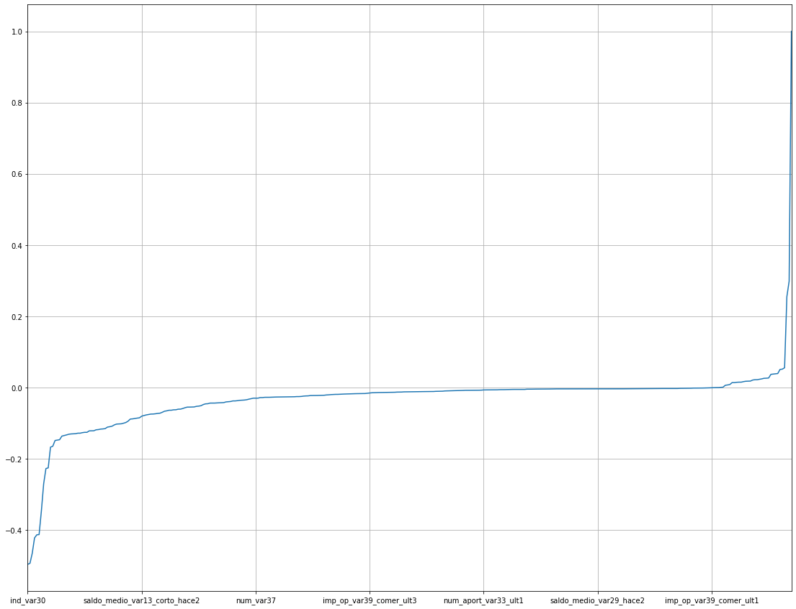
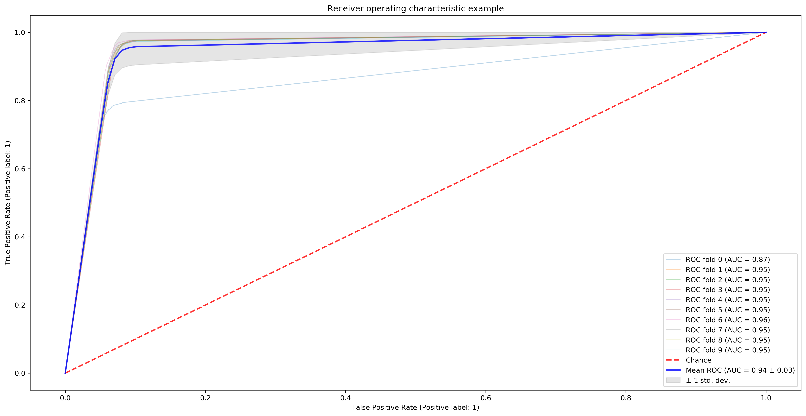

# Prevendo o Nível de Satisfação dos Clientes do Santander
### Projeto nº3 da Formação Cientista de Dados da Data Science Academy

## Especificação do problema

A satisfação do cliente é uma medida fundamental de sucesso. Clientes insatisfeitos cancelam seus serviços e raramente expressam sua insatisfação antes de sair. Clientes satisfeitos, por outro lado, se tornam defensores da marca!

O Banco Santander está pedindo para ajudá-los a identificar clientes insatisfeitos no início do relacionamento. Isso permitiria que o Santander adotasse medidas proativas para melhorar a felicidade de um cliente antes que seja tarde demais.

Neste projeto de aprendizado de máquina, serão utilizados centenas de recursos anônimos para prever se um cliente está satisfeito ou insatisfeito com sua experiência bancária.

O objetivo é prever a satisfação do cliente com base nos dados fornecidos e a acurácia do modelo deve ser de, pelo menos, 70%.

Neste projeto será utlizada a linguagem Python e o dataset disponível no Kaggle em:
https://www.kaggle.com/c/santander-customer-satisfaction

```python
import numpy as np
import pandas as pd
import matplotlib.pyplot as plt
%matplotlib inline
```

### Análise Exploratória de Dados


```python
df = pd.read_csv('./data/train.csv')
df
```


<div>
<style scoped>
    .dataframe tbody tr th:only-of-type {
        vertical-align: middle;
    }

    .dataframe tbody tr th {
        vertical-align: top;
    }

    .dataframe thead th {
        text-align: right;
    }
</style>
<table border="1" class="dataframe">
  <thead>
    <tr style="text-align: right;">
      <th></th>
      <th>ID</th>
      <th>var3</th>
      <th>var15</th>
      <th>imp_ent_var16_ult1</th>
      <th>imp_op_var39_comer_ult1</th>
      <th>imp_op_var39_comer_ult3</th>
      <th>imp_op_var40_comer_ult1</th>
      <th>imp_op_var40_comer_ult3</th>
      <th>imp_op_var40_efect_ult1</th>
      <th>imp_op_var40_efect_ult3</th>
      <th>...</th>
      <th>saldo_medio_var33_hace2</th>
      <th>saldo_medio_var33_hace3</th>
      <th>saldo_medio_var33_ult1</th>
      <th>saldo_medio_var33_ult3</th>
      <th>saldo_medio_var44_hace2</th>
      <th>saldo_medio_var44_hace3</th>
      <th>saldo_medio_var44_ult1</th>
      <th>saldo_medio_var44_ult3</th>
      <th>var38</th>
      <th>TARGET</th>
    </tr>
  </thead>
  <tbody>
    <tr>
      <td>0</td>
      <td>1</td>
      <td>2</td>
      <td>23</td>
      <td>0.0</td>
      <td>0.0</td>
      <td>0.0</td>
      <td>0.0</td>
      <td>0.0</td>
      <td>0.0</td>
      <td>0.0</td>
      <td>...</td>
      <td>0.0</td>
      <td>0.0</td>
      <td>0.0</td>
      <td>0.0</td>
      <td>0.0</td>
      <td>0.0</td>
      <td>0.0</td>
      <td>0.0</td>
      <td>39205.170000</td>
      <td>0</td>
    </tr>
    <tr>
      <td>1</td>
      <td>3</td>
      <td>2</td>
      <td>34</td>
      <td>0.0</td>
      <td>0.0</td>
      <td>0.0</td>
      <td>0.0</td>
      <td>0.0</td>
      <td>0.0</td>
      <td>0.0</td>
      <td>...</td>
      <td>0.0</td>
      <td>0.0</td>
      <td>0.0</td>
      <td>0.0</td>
      <td>0.0</td>
      <td>0.0</td>
      <td>0.0</td>
      <td>0.0</td>
      <td>49278.030000</td>
      <td>0</td>
    </tr>
    <tr>
      <td>2</td>
      <td>4</td>
      <td>2</td>
      <td>23</td>
      <td>0.0</td>
      <td>0.0</td>
      <td>0.0</td>
      <td>0.0</td>
      <td>0.0</td>
      <td>0.0</td>
      <td>0.0</td>
      <td>...</td>
      <td>0.0</td>
      <td>0.0</td>
      <td>0.0</td>
      <td>0.0</td>
      <td>0.0</td>
      <td>0.0</td>
      <td>0.0</td>
      <td>0.0</td>
      <td>67333.770000</td>
      <td>0</td>
    </tr>
    <tr>
      <td>3</td>
      <td>8</td>
      <td>2</td>
      <td>37</td>
      <td>0.0</td>
      <td>195.0</td>
      <td>195.0</td>
      <td>0.0</td>
      <td>0.0</td>
      <td>0.0</td>
      <td>0.0</td>
      <td>...</td>
      <td>0.0</td>
      <td>0.0</td>
      <td>0.0</td>
      <td>0.0</td>
      <td>0.0</td>
      <td>0.0</td>
      <td>0.0</td>
      <td>0.0</td>
      <td>64007.970000</td>
      <td>0</td>
    </tr>
    <tr>
      <td>4</td>
      <td>10</td>
      <td>2</td>
      <td>39</td>
      <td>0.0</td>
      <td>0.0</td>
      <td>0.0</td>
      <td>0.0</td>
      <td>0.0</td>
      <td>0.0</td>
      <td>0.0</td>
      <td>...</td>
      <td>0.0</td>
      <td>0.0</td>
      <td>0.0</td>
      <td>0.0</td>
      <td>0.0</td>
      <td>0.0</td>
      <td>0.0</td>
      <td>0.0</td>
      <td>117310.979016</td>
      <td>0</td>
    </tr>
    <tr>
      <td>...</td>
      <td>...</td>
      <td>...</td>
      <td>...</td>
      <td>...</td>
      <td>...</td>
      <td>...</td>
      <td>...</td>
      <td>...</td>
      <td>...</td>
      <td>...</td>
      <td>...</td>
      <td>...</td>
      <td>...</td>
      <td>...</td>
      <td>...</td>
      <td>...</td>
      <td>...</td>
      <td>...</td>
      <td>...</td>
      <td>...</td>
      <td>...</td>
    </tr>
    <tr>
      <td>76015</td>
      <td>151829</td>
      <td>2</td>
      <td>48</td>
      <td>0.0</td>
      <td>0.0</td>
      <td>0.0</td>
      <td>0.0</td>
      <td>0.0</td>
      <td>0.0</td>
      <td>0.0</td>
      <td>...</td>
      <td>0.0</td>
      <td>0.0</td>
      <td>0.0</td>
      <td>0.0</td>
      <td>0.0</td>
      <td>0.0</td>
      <td>0.0</td>
      <td>0.0</td>
      <td>60926.490000</td>
      <td>0</td>
    </tr>
    <tr>
      <td>76016</td>
      <td>151830</td>
      <td>2</td>
      <td>39</td>
      <td>0.0</td>
      <td>0.0</td>
      <td>0.0</td>
      <td>0.0</td>
      <td>0.0</td>
      <td>0.0</td>
      <td>0.0</td>
      <td>...</td>
      <td>0.0</td>
      <td>0.0</td>
      <td>0.0</td>
      <td>0.0</td>
      <td>0.0</td>
      <td>0.0</td>
      <td>0.0</td>
      <td>0.0</td>
      <td>118634.520000</td>
      <td>0</td>
    </tr>
    <tr>
      <td>76017</td>
      <td>151835</td>
      <td>2</td>
      <td>23</td>
      <td>0.0</td>
      <td>0.0</td>
      <td>0.0</td>
      <td>0.0</td>
      <td>0.0</td>
      <td>0.0</td>
      <td>0.0</td>
      <td>...</td>
      <td>0.0</td>
      <td>0.0</td>
      <td>0.0</td>
      <td>0.0</td>
      <td>0.0</td>
      <td>0.0</td>
      <td>0.0</td>
      <td>0.0</td>
      <td>74028.150000</td>
      <td>0</td>
    </tr>
    <tr>
      <td>76018</td>
      <td>151836</td>
      <td>2</td>
      <td>25</td>
      <td>0.0</td>
      <td>0.0</td>
      <td>0.0</td>
      <td>0.0</td>
      <td>0.0</td>
      <td>0.0</td>
      <td>0.0</td>
      <td>...</td>
      <td>0.0</td>
      <td>0.0</td>
      <td>0.0</td>
      <td>0.0</td>
      <td>0.0</td>
      <td>0.0</td>
      <td>0.0</td>
      <td>0.0</td>
      <td>84278.160000</td>
      <td>0</td>
    </tr>
    <tr>
      <td>76019</td>
      <td>151838</td>
      <td>2</td>
      <td>46</td>
      <td>0.0</td>
      <td>0.0</td>
      <td>0.0</td>
      <td>0.0</td>
      <td>0.0</td>
      <td>0.0</td>
      <td>0.0</td>
      <td>...</td>
      <td>0.0</td>
      <td>0.0</td>
      <td>0.0</td>
      <td>0.0</td>
      <td>0.0</td>
      <td>0.0</td>
      <td>0.0</td>
      <td>0.0</td>
      <td>117310.979016</td>
      <td>0</td>
    </tr>
  </tbody>
</table>
<p>76020 rows × 371 columns</p>
</div>


```python
df.set_index('ID', inplace=True)
df
```


<div>
<style scoped>
    .dataframe tbody tr th:only-of-type {
        vertical-align: middle;
    }

    .dataframe tbody tr th {
        vertical-align: top;
    }

    .dataframe thead th {
        text-align: right;
    }
</style>
<table border="1" class="dataframe">
  <thead>
    <tr style="text-align: right;">
      <th></th>
      <th>var3</th>
      <th>var15</th>
      <th>imp_ent_var16_ult1</th>
      <th>imp_op_var39_comer_ult1</th>
      <th>imp_op_var39_comer_ult3</th>
      <th>imp_op_var40_comer_ult1</th>
      <th>imp_op_var40_comer_ult3</th>
      <th>imp_op_var40_efect_ult1</th>
      <th>imp_op_var40_efect_ult3</th>
      <th>imp_op_var40_ult1</th>
      <th>...</th>
      <th>saldo_medio_var33_hace2</th>
      <th>saldo_medio_var33_hace3</th>
      <th>saldo_medio_var33_ult1</th>
      <th>saldo_medio_var33_ult3</th>
      <th>saldo_medio_var44_hace2</th>
      <th>saldo_medio_var44_hace3</th>
      <th>saldo_medio_var44_ult1</th>
      <th>saldo_medio_var44_ult3</th>
      <th>var38</th>
      <th>TARGET</th>
    </tr>
    <tr>
      <th>ID</th>
      <th></th>
      <th></th>
      <th></th>
      <th></th>
      <th></th>
      <th></th>
      <th></th>
      <th></th>
      <th></th>
      <th></th>
      <th></th>
      <th></th>
      <th></th>
      <th></th>
      <th></th>
      <th></th>
      <th></th>
      <th></th>
      <th></th>
      <th></th>
      <th></th>
    </tr>
  </thead>
  <tbody>
    <tr>
      <td>1</td>
      <td>2</td>
      <td>23</td>
      <td>0.0</td>
      <td>0.0</td>
      <td>0.0</td>
      <td>0.0</td>
      <td>0.0</td>
      <td>0.0</td>
      <td>0.0</td>
      <td>0.0</td>
      <td>...</td>
      <td>0.0</td>
      <td>0.0</td>
      <td>0.0</td>
      <td>0.0</td>
      <td>0.0</td>
      <td>0.0</td>
      <td>0.0</td>
      <td>0.0</td>
      <td>39205.170000</td>
      <td>0</td>
    </tr>
    <tr>
      <td>3</td>
      <td>2</td>
      <td>34</td>
      <td>0.0</td>
      <td>0.0</td>
      <td>0.0</td>
      <td>0.0</td>
      <td>0.0</td>
      <td>0.0</td>
      <td>0.0</td>
      <td>0.0</td>
      <td>...</td>
      <td>0.0</td>
      <td>0.0</td>
      <td>0.0</td>
      <td>0.0</td>
      <td>0.0</td>
      <td>0.0</td>
      <td>0.0</td>
      <td>0.0</td>
      <td>49278.030000</td>
      <td>0</td>
    </tr>
    <tr>
      <td>4</td>
      <td>2</td>
      <td>23</td>
      <td>0.0</td>
      <td>0.0</td>
      <td>0.0</td>
      <td>0.0</td>
      <td>0.0</td>
      <td>0.0</td>
      <td>0.0</td>
      <td>0.0</td>
      <td>...</td>
      <td>0.0</td>
      <td>0.0</td>
      <td>0.0</td>
      <td>0.0</td>
      <td>0.0</td>
      <td>0.0</td>
      <td>0.0</td>
      <td>0.0</td>
      <td>67333.770000</td>
      <td>0</td>
    </tr>
    <tr>
      <td>8</td>
      <td>2</td>
      <td>37</td>
      <td>0.0</td>
      <td>195.0</td>
      <td>195.0</td>
      <td>0.0</td>
      <td>0.0</td>
      <td>0.0</td>
      <td>0.0</td>
      <td>0.0</td>
      <td>...</td>
      <td>0.0</td>
      <td>0.0</td>
      <td>0.0</td>
      <td>0.0</td>
      <td>0.0</td>
      <td>0.0</td>
      <td>0.0</td>
      <td>0.0</td>
      <td>64007.970000</td>
      <td>0</td>
    </tr>
    <tr>
      <td>10</td>
      <td>2</td>
      <td>39</td>
      <td>0.0</td>
      <td>0.0</td>
      <td>0.0</td>
      <td>0.0</td>
      <td>0.0</td>
      <td>0.0</td>
      <td>0.0</td>
      <td>0.0</td>
      <td>...</td>
      <td>0.0</td>
      <td>0.0</td>
      <td>0.0</td>
      <td>0.0</td>
      <td>0.0</td>
      <td>0.0</td>
      <td>0.0</td>
      <td>0.0</td>
      <td>117310.979016</td>
      <td>0</td>
    </tr>
    <tr>
      <td>...</td>
      <td>...</td>
      <td>...</td>
      <td>...</td>
      <td>...</td>
      <td>...</td>
      <td>...</td>
      <td>...</td>
      <td>...</td>
      <td>...</td>
      <td>...</td>
      <td>...</td>
      <td>...</td>
      <td>...</td>
      <td>...</td>
      <td>...</td>
      <td>...</td>
      <td>...</td>
      <td>...</td>
      <td>...</td>
      <td>...</td>
      <td>...</td>
    </tr>
    <tr>
      <td>151829</td>
      <td>2</td>
      <td>48</td>
      <td>0.0</td>
      <td>0.0</td>
      <td>0.0</td>
      <td>0.0</td>
      <td>0.0</td>
      <td>0.0</td>
      <td>0.0</td>
      <td>0.0</td>
      <td>...</td>
      <td>0.0</td>
      <td>0.0</td>
      <td>0.0</td>
      <td>0.0</td>
      <td>0.0</td>
      <td>0.0</td>
      <td>0.0</td>
      <td>0.0</td>
      <td>60926.490000</td>
      <td>0</td>
    </tr>
    <tr>
      <td>151830</td>
      <td>2</td>
      <td>39</td>
      <td>0.0</td>
      <td>0.0</td>
      <td>0.0</td>
      <td>0.0</td>
      <td>0.0</td>
      <td>0.0</td>
      <td>0.0</td>
      <td>0.0</td>
      <td>...</td>
      <td>0.0</td>
      <td>0.0</td>
      <td>0.0</td>
      <td>0.0</td>
      <td>0.0</td>
      <td>0.0</td>
      <td>0.0</td>
      <td>0.0</td>
      <td>118634.520000</td>
      <td>0</td>
    </tr>
    <tr>
      <td>151835</td>
      <td>2</td>
      <td>23</td>
      <td>0.0</td>
      <td>0.0</td>
      <td>0.0</td>
      <td>0.0</td>
      <td>0.0</td>
      <td>0.0</td>
      <td>0.0</td>
      <td>0.0</td>
      <td>...</td>
      <td>0.0</td>
      <td>0.0</td>
      <td>0.0</td>
      <td>0.0</td>
      <td>0.0</td>
      <td>0.0</td>
      <td>0.0</td>
      <td>0.0</td>
      <td>74028.150000</td>
      <td>0</td>
    </tr>
    <tr>
      <td>151836</td>
      <td>2</td>
      <td>25</td>
      <td>0.0</td>
      <td>0.0</td>
      <td>0.0</td>
      <td>0.0</td>
      <td>0.0</td>
      <td>0.0</td>
      <td>0.0</td>
      <td>0.0</td>
      <td>...</td>
      <td>0.0</td>
      <td>0.0</td>
      <td>0.0</td>
      <td>0.0</td>
      <td>0.0</td>
      <td>0.0</td>
      <td>0.0</td>
      <td>0.0</td>
      <td>84278.160000</td>
      <td>0</td>
    </tr>
    <tr>
      <td>151838</td>
      <td>2</td>
      <td>46</td>
      <td>0.0</td>
      <td>0.0</td>
      <td>0.0</td>
      <td>0.0</td>
      <td>0.0</td>
      <td>0.0</td>
      <td>0.0</td>
      <td>0.0</td>
      <td>...</td>
      <td>0.0</td>
      <td>0.0</td>
      <td>0.0</td>
      <td>0.0</td>
      <td>0.0</td>
      <td>0.0</td>
      <td>0.0</td>
      <td>0.0</td>
      <td>117310.979016</td>
      <td>0</td>
    </tr>
  </tbody>
</table>
<p>76020 rows × 370 columns</p>
</div>


```python
df.describe()
```


<div>
<style scoped>
    .dataframe tbody tr th:only-of-type {
        vertical-align: middle;
    }

    .dataframe tbody tr th {
        vertical-align: top;
    }

    .dataframe thead th {
        text-align: right;
    }
</style>
<table border="1" class="dataframe">
  <thead>
    <tr style="text-align: right;">
      <th></th>
      <th>var3</th>
      <th>var15</th>
      <th>imp_ent_var16_ult1</th>
      <th>imp_op_var39_comer_ult1</th>
      <th>imp_op_var39_comer_ult3</th>
      <th>imp_op_var40_comer_ult1</th>
      <th>imp_op_var40_comer_ult3</th>
      <th>imp_op_var40_efect_ult1</th>
      <th>imp_op_var40_efect_ult3</th>
      <th>imp_op_var40_ult1</th>
      <th>...</th>
      <th>saldo_medio_var33_hace2</th>
      <th>saldo_medio_var33_hace3</th>
      <th>saldo_medio_var33_ult1</th>
      <th>saldo_medio_var33_ult3</th>
      <th>saldo_medio_var44_hace2</th>
      <th>saldo_medio_var44_hace3</th>
      <th>saldo_medio_var44_ult1</th>
      <th>saldo_medio_var44_ult3</th>
      <th>var38</th>
      <th>TARGET</th>
    </tr>
  </thead>
  <tbody>
    <tr>
      <td>count</td>
      <td>76020.000000</td>
      <td>76020.000000</td>
      <td>76020.000000</td>
      <td>76020.000000</td>
      <td>76020.000000</td>
      <td>76020.000000</td>
      <td>76020.000000</td>
      <td>76020.000000</td>
      <td>76020.000000</td>
      <td>76020.000000</td>
      <td>...</td>
      <td>76020.000000</td>
      <td>76020.000000</td>
      <td>76020.000000</td>
      <td>76020.000000</td>
      <td>76020.000000</td>
      <td>76020.000000</td>
      <td>76020.000000</td>
      <td>76020.000000</td>
      <td>7.602000e+04</td>
      <td>76020.000000</td>
    </tr>
    <tr>
      <td>mean</td>
      <td>-1523.199277</td>
      <td>33.212865</td>
      <td>86.208265</td>
      <td>72.363067</td>
      <td>119.529632</td>
      <td>3.559130</td>
      <td>6.472698</td>
      <td>0.412946</td>
      <td>0.567352</td>
      <td>3.160715</td>
      <td>...</td>
      <td>7.935824</td>
      <td>1.365146</td>
      <td>12.215580</td>
      <td>8.784074</td>
      <td>31.505324</td>
      <td>1.858575</td>
      <td>76.026165</td>
      <td>56.614351</td>
      <td>1.172358e+05</td>
      <td>0.039569</td>
    </tr>
    <tr>
      <td>std</td>
      <td>39033.462364</td>
      <td>12.956486</td>
      <td>1614.757313</td>
      <td>339.315831</td>
      <td>546.266294</td>
      <td>93.155749</td>
      <td>153.737066</td>
      <td>30.604864</td>
      <td>36.513513</td>
      <td>95.268204</td>
      <td>...</td>
      <td>455.887218</td>
      <td>113.959637</td>
      <td>783.207399</td>
      <td>538.439211</td>
      <td>2013.125393</td>
      <td>147.786584</td>
      <td>4040.337842</td>
      <td>2852.579397</td>
      <td>1.826646e+05</td>
      <td>0.194945</td>
    </tr>
    <tr>
      <td>min</td>
      <td>-999999.000000</td>
      <td>5.000000</td>
      <td>0.000000</td>
      <td>0.000000</td>
      <td>0.000000</td>
      <td>0.000000</td>
      <td>0.000000</td>
      <td>0.000000</td>
      <td>0.000000</td>
      <td>0.000000</td>
      <td>...</td>
      <td>0.000000</td>
      <td>0.000000</td>
      <td>0.000000</td>
      <td>0.000000</td>
      <td>0.000000</td>
      <td>0.000000</td>
      <td>0.000000</td>
      <td>0.000000</td>
      <td>5.163750e+03</td>
      <td>0.000000</td>
    </tr>
    <tr>
      <td>25%</td>
      <td>2.000000</td>
      <td>23.000000</td>
      <td>0.000000</td>
      <td>0.000000</td>
      <td>0.000000</td>
      <td>0.000000</td>
      <td>0.000000</td>
      <td>0.000000</td>
      <td>0.000000</td>
      <td>0.000000</td>
      <td>...</td>
      <td>0.000000</td>
      <td>0.000000</td>
      <td>0.000000</td>
      <td>0.000000</td>
      <td>0.000000</td>
      <td>0.000000</td>
      <td>0.000000</td>
      <td>0.000000</td>
      <td>6.787061e+04</td>
      <td>0.000000</td>
    </tr>
    <tr>
      <td>50%</td>
      <td>2.000000</td>
      <td>28.000000</td>
      <td>0.000000</td>
      <td>0.000000</td>
      <td>0.000000</td>
      <td>0.000000</td>
      <td>0.000000</td>
      <td>0.000000</td>
      <td>0.000000</td>
      <td>0.000000</td>
      <td>...</td>
      <td>0.000000</td>
      <td>0.000000</td>
      <td>0.000000</td>
      <td>0.000000</td>
      <td>0.000000</td>
      <td>0.000000</td>
      <td>0.000000</td>
      <td>0.000000</td>
      <td>1.064092e+05</td>
      <td>0.000000</td>
    </tr>
    <tr>
      <td>75%</td>
      <td>2.000000</td>
      <td>40.000000</td>
      <td>0.000000</td>
      <td>0.000000</td>
      <td>0.000000</td>
      <td>0.000000</td>
      <td>0.000000</td>
      <td>0.000000</td>
      <td>0.000000</td>
      <td>0.000000</td>
      <td>...</td>
      <td>0.000000</td>
      <td>0.000000</td>
      <td>0.000000</td>
      <td>0.000000</td>
      <td>0.000000</td>
      <td>0.000000</td>
      <td>0.000000</td>
      <td>0.000000</td>
      <td>1.187563e+05</td>
      <td>0.000000</td>
    </tr>
    <tr>
      <td>max</td>
      <td>238.000000</td>
      <td>105.000000</td>
      <td>210000.000000</td>
      <td>12888.030000</td>
      <td>21024.810000</td>
      <td>8237.820000</td>
      <td>11073.570000</td>
      <td>6600.000000</td>
      <td>6600.000000</td>
      <td>8237.820000</td>
      <td>...</td>
      <td>50003.880000</td>
      <td>20385.720000</td>
      <td>138831.630000</td>
      <td>91778.730000</td>
      <td>438329.220000</td>
      <td>24650.010000</td>
      <td>681462.900000</td>
      <td>397884.300000</td>
      <td>2.203474e+07</td>
      <td>1.000000</td>
    </tr>
  </tbody>
</table>
<p>8 rows × 370 columns</p>
</div>


```python
# Verificando quantos valores únicos há em cada coluna do dataset
n_unicos = pd.DataFrame(columns=['N_unicos'])
for col in df.columns:
    n_unicos.loc[col] = len(df[col].unique())
```


```python
# Extraindo o número de valores únicos existente em cada variável do dataset.
n_unicos
```


<div>
<style scoped>
    .dataframe tbody tr th:only-of-type {
        vertical-align: middle;
    }

    .dataframe tbody tr th {
        vertical-align: top;
    }

    .dataframe thead th {
        text-align: right;
    }
</style>
<table border="1" class="dataframe">
  <thead>
    <tr style="text-align: right;">
      <th></th>
      <th>N_unicos</th>
    </tr>
  </thead>
  <tbody>
    <tr>
      <td>var3</td>
      <td>208</td>
    </tr>
    <tr>
      <td>var15</td>
      <td>100</td>
    </tr>
    <tr>
      <td>imp_ent_var16_ult1</td>
      <td>596</td>
    </tr>
    <tr>
      <td>imp_op_var39_comer_ult1</td>
      <td>7551</td>
    </tr>
    <tr>
      <td>imp_op_var39_comer_ult3</td>
      <td>9099</td>
    </tr>
    <tr>
      <td>...</td>
      <td>...</td>
    </tr>
    <tr>
      <td>saldo_medio_var44_hace3</td>
      <td>33</td>
    </tr>
    <tr>
      <td>saldo_medio_var44_ult1</td>
      <td>141</td>
    </tr>
    <tr>
      <td>saldo_medio_var44_ult3</td>
      <td>141</td>
    </tr>
    <tr>
      <td>var38</td>
      <td>57736</td>
    </tr>
    <tr>
      <td>TARGET</td>
      <td>2</td>
    </tr>
  </tbody>
</table>
<p>370 rows × 1 columns</p>
</div>


```python
agrup = n_unicos.reset_index()
agrup.groupby('N_unicos', as_index=True).count().head(20)
```


<div>
<style scoped>
    .dataframe tbody tr th:only-of-type {
        vertical-align: middle;
    }

    .dataframe tbody tr th {
        vertical-align: top;
    }

    .dataframe thead th {
        text-align: right;
    }
</style>
<table border="1" class="dataframe">
  <thead>
    <tr style="text-align: right;">
      <th></th>
      <th>index</th>
    </tr>
    <tr>
      <th>N_unicos</th>
      <th></th>
    </tr>
  </thead>
  <tbody>
    <tr>
      <td>1</td>
      <td>34</td>
    </tr>
    <tr>
      <td>2</td>
      <td>106</td>
    </tr>
    <tr>
      <td>3</td>
      <td>31</td>
    </tr>
    <tr>
      <td>4</td>
      <td>20</td>
    </tr>
    <tr>
      <td>5</td>
      <td>14</td>
    </tr>
    <tr>
      <td>6</td>
      <td>7</td>
    </tr>
    <tr>
      <td>7</td>
      <td>9</td>
    </tr>
    <tr>
      <td>8</td>
      <td>4</td>
    </tr>
    <tr>
      <td>9</td>
      <td>13</td>
    </tr>
    <tr>
      <td>10</td>
      <td>1</td>
    </tr>
    <tr>
      <td>11</td>
      <td>3</td>
    </tr>
    <tr>
      <td>13</td>
      <td>2</td>
    </tr>
    <tr>
      <td>15</td>
      <td>1</td>
    </tr>
    <tr>
      <td>16</td>
      <td>1</td>
    </tr>
    <tr>
      <td>17</td>
      <td>1</td>
    </tr>
    <tr>
      <td>18</td>
      <td>3</td>
    </tr>
    <tr>
      <td>19</td>
      <td>2</td>
    </tr>
    <tr>
      <td>20</td>
      <td>2</td>
    </tr>
    <tr>
      <td>21</td>
      <td>1</td>
    </tr>
    <tr>
      <td>22</td>
      <td>5</td>
    </tr>
  </tbody>
</table>
</div>


### Feature selection

Da tabela acima depreende-se que existem 34 variáveis com 1 valor único possível, isto é, que não apresentam variação e podem, portanto, serem excluídas da análise.
106 variáveis apresentam valor 2 valores únicos (variáveis binárias), 31 variáveis apresentam 3 valores únicos possíveis, etc.


```python
# Variáveis que não apresentam variação:
n_unicos[n_unicos['N_unicos']==1]
```


<div>
<style scoped>
    .dataframe tbody tr th:only-of-type {
        vertical-align: middle;
    }

    .dataframe tbody tr th {
        vertical-align: top;
    }

    .dataframe thead th {
        text-align: right;
    }
</style>
<table border="1" class="dataframe">
  <thead>
    <tr style="text-align: right;">
      <th></th>
      <th>N_unicos</th>
    </tr>
  </thead>
  <tbody>
    <tr>
      <td>ind_var2_0</td>
      <td>1</td>
    </tr>
    <tr>
      <td>ind_var2</td>
      <td>1</td>
    </tr>
    <tr>
      <td>ind_var27_0</td>
      <td>1</td>
    </tr>
    <tr>
      <td>ind_var28_0</td>
      <td>1</td>
    </tr>
    <tr>
      <td>ind_var28</td>
      <td>1</td>
    </tr>
    <tr>
      <td>ind_var27</td>
      <td>1</td>
    </tr>
    <tr>
      <td>ind_var41</td>
      <td>1</td>
    </tr>
    <tr>
      <td>ind_var46_0</td>
      <td>1</td>
    </tr>
    <tr>
      <td>ind_var46</td>
      <td>1</td>
    </tr>
    <tr>
      <td>num_var27_0</td>
      <td>1</td>
    </tr>
    <tr>
      <td>num_var28_0</td>
      <td>1</td>
    </tr>
    <tr>
      <td>num_var28</td>
      <td>1</td>
    </tr>
    <tr>
      <td>num_var27</td>
      <td>1</td>
    </tr>
    <tr>
      <td>num_var41</td>
      <td>1</td>
    </tr>
    <tr>
      <td>num_var46_0</td>
      <td>1</td>
    </tr>
    <tr>
      <td>num_var46</td>
      <td>1</td>
    </tr>
    <tr>
      <td>saldo_var28</td>
      <td>1</td>
    </tr>
    <tr>
      <td>saldo_var27</td>
      <td>1</td>
    </tr>
    <tr>
      <td>saldo_var41</td>
      <td>1</td>
    </tr>
    <tr>
      <td>saldo_var46</td>
      <td>1</td>
    </tr>
    <tr>
      <td>imp_amort_var18_hace3</td>
      <td>1</td>
    </tr>
    <tr>
      <td>imp_amort_var34_hace3</td>
      <td>1</td>
    </tr>
    <tr>
      <td>imp_reemb_var13_hace3</td>
      <td>1</td>
    </tr>
    <tr>
      <td>imp_reemb_var33_hace3</td>
      <td>1</td>
    </tr>
    <tr>
      <td>imp_trasp_var17_out_hace3</td>
      <td>1</td>
    </tr>
    <tr>
      <td>imp_trasp_var33_out_hace3</td>
      <td>1</td>
    </tr>
    <tr>
      <td>num_var2_0_ult1</td>
      <td>1</td>
    </tr>
    <tr>
      <td>num_var2_ult1</td>
      <td>1</td>
    </tr>
    <tr>
      <td>num_reemb_var13_hace3</td>
      <td>1</td>
    </tr>
    <tr>
      <td>num_reemb_var33_hace3</td>
      <td>1</td>
    </tr>
    <tr>
      <td>num_trasp_var17_out_hace3</td>
      <td>1</td>
    </tr>
    <tr>
      <td>num_trasp_var33_out_hace3</td>
      <td>1</td>
    </tr>
    <tr>
      <td>saldo_var2_ult1</td>
      <td>1</td>
    </tr>
    <tr>
      <td>saldo_medio_var13_medio_hace3</td>
      <td>1</td>
    </tr>
  </tbody>
</table>
</div>


```python
excluir = n_unicos[n_unicos['N_unicos']==1].index
excluir
```


    Index(['ind_var2_0', 'ind_var2', 'ind_var27_0', 'ind_var28_0', 'ind_var28',
           'ind_var27', 'ind_var41', 'ind_var46_0', 'ind_var46', 'num_var27_0',
           'num_var28_0', 'num_var28', 'num_var27', 'num_var41', 'num_var46_0',
           'num_var46', 'saldo_var28', 'saldo_var27', 'saldo_var41', 'saldo_var46',
           'imp_amort_var18_hace3', 'imp_amort_var34_hace3',
           'imp_reemb_var13_hace3', 'imp_reemb_var33_hace3',
           'imp_trasp_var17_out_hace3', 'imp_trasp_var33_out_hace3',
           'num_var2_0_ult1', 'num_var2_ult1', 'num_reemb_var13_hace3',
           'num_reemb_var33_hace3', 'num_trasp_var17_out_hace3',
           'num_trasp_var33_out_hace3', 'saldo_var2_ult1',
           'saldo_medio_var13_medio_hace3'],
          dtype='object')


```python
df[excluir]
```


<div>
<style scoped>
    .dataframe tbody tr th:only-of-type {
        vertical-align: middle;
    }

    .dataframe tbody tr th {
        vertical-align: top;
    }

    .dataframe thead th {
        text-align: right;
    }
</style>
<table border="1" class="dataframe">
  <thead>
    <tr style="text-align: right;">
      <th></th>
      <th>ind_var2_0</th>
      <th>ind_var2</th>
      <th>ind_var27_0</th>
      <th>ind_var28_0</th>
      <th>ind_var28</th>
      <th>ind_var27</th>
      <th>ind_var41</th>
      <th>ind_var46_0</th>
      <th>ind_var46</th>
      <th>num_var27_0</th>
      <th>...</th>
      <th>imp_trasp_var17_out_hace3</th>
      <th>imp_trasp_var33_out_hace3</th>
      <th>num_var2_0_ult1</th>
      <th>num_var2_ult1</th>
      <th>num_reemb_var13_hace3</th>
      <th>num_reemb_var33_hace3</th>
      <th>num_trasp_var17_out_hace3</th>
      <th>num_trasp_var33_out_hace3</th>
      <th>saldo_var2_ult1</th>
      <th>saldo_medio_var13_medio_hace3</th>
    </tr>
    <tr>
      <th>ID</th>
      <th></th>
      <th></th>
      <th></th>
      <th></th>
      <th></th>
      <th></th>
      <th></th>
      <th></th>
      <th></th>
      <th></th>
      <th></th>
      <th></th>
      <th></th>
      <th></th>
      <th></th>
      <th></th>
      <th></th>
      <th></th>
      <th></th>
      <th></th>
      <th></th>
    </tr>
  </thead>
  <tbody>
    <tr>
      <td>1</td>
      <td>0</td>
      <td>0</td>
      <td>0</td>
      <td>0</td>
      <td>0</td>
      <td>0</td>
      <td>0</td>
      <td>0</td>
      <td>0</td>
      <td>0</td>
      <td>...</td>
      <td>0</td>
      <td>0</td>
      <td>0</td>
      <td>0</td>
      <td>0</td>
      <td>0</td>
      <td>0</td>
      <td>0</td>
      <td>0</td>
      <td>0</td>
    </tr>
    <tr>
      <td>3</td>
      <td>0</td>
      <td>0</td>
      <td>0</td>
      <td>0</td>
      <td>0</td>
      <td>0</td>
      <td>0</td>
      <td>0</td>
      <td>0</td>
      <td>0</td>
      <td>...</td>
      <td>0</td>
      <td>0</td>
      <td>0</td>
      <td>0</td>
      <td>0</td>
      <td>0</td>
      <td>0</td>
      <td>0</td>
      <td>0</td>
      <td>0</td>
    </tr>
    <tr>
      <td>4</td>
      <td>0</td>
      <td>0</td>
      <td>0</td>
      <td>0</td>
      <td>0</td>
      <td>0</td>
      <td>0</td>
      <td>0</td>
      <td>0</td>
      <td>0</td>
      <td>...</td>
      <td>0</td>
      <td>0</td>
      <td>0</td>
      <td>0</td>
      <td>0</td>
      <td>0</td>
      <td>0</td>
      <td>0</td>
      <td>0</td>
      <td>0</td>
    </tr>
    <tr>
      <td>8</td>
      <td>0</td>
      <td>0</td>
      <td>0</td>
      <td>0</td>
      <td>0</td>
      <td>0</td>
      <td>0</td>
      <td>0</td>
      <td>0</td>
      <td>0</td>
      <td>...</td>
      <td>0</td>
      <td>0</td>
      <td>0</td>
      <td>0</td>
      <td>0</td>
      <td>0</td>
      <td>0</td>
      <td>0</td>
      <td>0</td>
      <td>0</td>
    </tr>
    <tr>
      <td>10</td>
      <td>0</td>
      <td>0</td>
      <td>0</td>
      <td>0</td>
      <td>0</td>
      <td>0</td>
      <td>0</td>
      <td>0</td>
      <td>0</td>
      <td>0</td>
      <td>...</td>
      <td>0</td>
      <td>0</td>
      <td>0</td>
      <td>0</td>
      <td>0</td>
      <td>0</td>
      <td>0</td>
      <td>0</td>
      <td>0</td>
      <td>0</td>
    </tr>
    <tr>
      <td>...</td>
      <td>...</td>
      <td>...</td>
      <td>...</td>
      <td>...</td>
      <td>...</td>
      <td>...</td>
      <td>...</td>
      <td>...</td>
      <td>...</td>
      <td>...</td>
      <td>...</td>
      <td>...</td>
      <td>...</td>
      <td>...</td>
      <td>...</td>
      <td>...</td>
      <td>...</td>
      <td>...</td>
      <td>...</td>
      <td>...</td>
      <td>...</td>
    </tr>
    <tr>
      <td>151829</td>
      <td>0</td>
      <td>0</td>
      <td>0</td>
      <td>0</td>
      <td>0</td>
      <td>0</td>
      <td>0</td>
      <td>0</td>
      <td>0</td>
      <td>0</td>
      <td>...</td>
      <td>0</td>
      <td>0</td>
      <td>0</td>
      <td>0</td>
      <td>0</td>
      <td>0</td>
      <td>0</td>
      <td>0</td>
      <td>0</td>
      <td>0</td>
    </tr>
    <tr>
      <td>151830</td>
      <td>0</td>
      <td>0</td>
      <td>0</td>
      <td>0</td>
      <td>0</td>
      <td>0</td>
      <td>0</td>
      <td>0</td>
      <td>0</td>
      <td>0</td>
      <td>...</td>
      <td>0</td>
      <td>0</td>
      <td>0</td>
      <td>0</td>
      <td>0</td>
      <td>0</td>
      <td>0</td>
      <td>0</td>
      <td>0</td>
      <td>0</td>
    </tr>
    <tr>
      <td>151835</td>
      <td>0</td>
      <td>0</td>
      <td>0</td>
      <td>0</td>
      <td>0</td>
      <td>0</td>
      <td>0</td>
      <td>0</td>
      <td>0</td>
      <td>0</td>
      <td>...</td>
      <td>0</td>
      <td>0</td>
      <td>0</td>
      <td>0</td>
      <td>0</td>
      <td>0</td>
      <td>0</td>
      <td>0</td>
      <td>0</td>
      <td>0</td>
    </tr>
    <tr>
      <td>151836</td>
      <td>0</td>
      <td>0</td>
      <td>0</td>
      <td>0</td>
      <td>0</td>
      <td>0</td>
      <td>0</td>
      <td>0</td>
      <td>0</td>
      <td>0</td>
      <td>...</td>
      <td>0</td>
      <td>0</td>
      <td>0</td>
      <td>0</td>
      <td>0</td>
      <td>0</td>
      <td>0</td>
      <td>0</td>
      <td>0</td>
      <td>0</td>
    </tr>
    <tr>
      <td>151838</td>
      <td>0</td>
      <td>0</td>
      <td>0</td>
      <td>0</td>
      <td>0</td>
      <td>0</td>
      <td>0</td>
      <td>0</td>
      <td>0</td>
      <td>0</td>
      <td>...</td>
      <td>0</td>
      <td>0</td>
      <td>0</td>
      <td>0</td>
      <td>0</td>
      <td>0</td>
      <td>0</td>
      <td>0</td>
      <td>0</td>
      <td>0</td>
    </tr>
  </tbody>
</table>
<p>76020 rows × 34 columns</p>
</div>


```python
# Excluindo do dataset as variáveis que não apresentam variação
df.drop(excluir, axis=1, inplace=True)
df
```


<div>
<style scoped>
    .dataframe tbody tr th:only-of-type {
        vertical-align: middle;
    }

    .dataframe tbody tr th {
        vertical-align: top;
    }

    .dataframe thead th {
        text-align: right;
    }
</style>
<table border="1" class="dataframe">
  <thead>
    <tr style="text-align: right;">
      <th></th>
      <th>var3</th>
      <th>var15</th>
      <th>imp_ent_var16_ult1</th>
      <th>imp_op_var39_comer_ult1</th>
      <th>imp_op_var39_comer_ult3</th>
      <th>imp_op_var40_comer_ult1</th>
      <th>imp_op_var40_comer_ult3</th>
      <th>imp_op_var40_efect_ult1</th>
      <th>imp_op_var40_efect_ult3</th>
      <th>imp_op_var40_ult1</th>
      <th>...</th>
      <th>saldo_medio_var33_hace2</th>
      <th>saldo_medio_var33_hace3</th>
      <th>saldo_medio_var33_ult1</th>
      <th>saldo_medio_var33_ult3</th>
      <th>saldo_medio_var44_hace2</th>
      <th>saldo_medio_var44_hace3</th>
      <th>saldo_medio_var44_ult1</th>
      <th>saldo_medio_var44_ult3</th>
      <th>var38</th>
      <th>TARGET</th>
    </tr>
    <tr>
      <th>ID</th>
      <th></th>
      <th></th>
      <th></th>
      <th></th>
      <th></th>
      <th></th>
      <th></th>
      <th></th>
      <th></th>
      <th></th>
      <th></th>
      <th></th>
      <th></th>
      <th></th>
      <th></th>
      <th></th>
      <th></th>
      <th></th>
      <th></th>
      <th></th>
      <th></th>
    </tr>
  </thead>
  <tbody>
    <tr>
      <td>1</td>
      <td>2</td>
      <td>23</td>
      <td>0.0</td>
      <td>0.0</td>
      <td>0.0</td>
      <td>0.0</td>
      <td>0.0</td>
      <td>0.0</td>
      <td>0.0</td>
      <td>0.0</td>
      <td>...</td>
      <td>0.0</td>
      <td>0.0</td>
      <td>0.0</td>
      <td>0.0</td>
      <td>0.0</td>
      <td>0.0</td>
      <td>0.0</td>
      <td>0.0</td>
      <td>39205.170000</td>
      <td>0</td>
    </tr>
    <tr>
      <td>3</td>
      <td>2</td>
      <td>34</td>
      <td>0.0</td>
      <td>0.0</td>
      <td>0.0</td>
      <td>0.0</td>
      <td>0.0</td>
      <td>0.0</td>
      <td>0.0</td>
      <td>0.0</td>
      <td>...</td>
      <td>0.0</td>
      <td>0.0</td>
      <td>0.0</td>
      <td>0.0</td>
      <td>0.0</td>
      <td>0.0</td>
      <td>0.0</td>
      <td>0.0</td>
      <td>49278.030000</td>
      <td>0</td>
    </tr>
    <tr>
      <td>4</td>
      <td>2</td>
      <td>23</td>
      <td>0.0</td>
      <td>0.0</td>
      <td>0.0</td>
      <td>0.0</td>
      <td>0.0</td>
      <td>0.0</td>
      <td>0.0</td>
      <td>0.0</td>
      <td>...</td>
      <td>0.0</td>
      <td>0.0</td>
      <td>0.0</td>
      <td>0.0</td>
      <td>0.0</td>
      <td>0.0</td>
      <td>0.0</td>
      <td>0.0</td>
      <td>67333.770000</td>
      <td>0</td>
    </tr>
    <tr>
      <td>8</td>
      <td>2</td>
      <td>37</td>
      <td>0.0</td>
      <td>195.0</td>
      <td>195.0</td>
      <td>0.0</td>
      <td>0.0</td>
      <td>0.0</td>
      <td>0.0</td>
      <td>0.0</td>
      <td>...</td>
      <td>0.0</td>
      <td>0.0</td>
      <td>0.0</td>
      <td>0.0</td>
      <td>0.0</td>
      <td>0.0</td>
      <td>0.0</td>
      <td>0.0</td>
      <td>64007.970000</td>
      <td>0</td>
    </tr>
    <tr>
      <td>10</td>
      <td>2</td>
      <td>39</td>
      <td>0.0</td>
      <td>0.0</td>
      <td>0.0</td>
      <td>0.0</td>
      <td>0.0</td>
      <td>0.0</td>
      <td>0.0</td>
      <td>0.0</td>
      <td>...</td>
      <td>0.0</td>
      <td>0.0</td>
      <td>0.0</td>
      <td>0.0</td>
      <td>0.0</td>
      <td>0.0</td>
      <td>0.0</td>
      <td>0.0</td>
      <td>117310.979016</td>
      <td>0</td>
    </tr>
    <tr>
      <td>...</td>
      <td>...</td>
      <td>...</td>
      <td>...</td>
      <td>...</td>
      <td>...</td>
      <td>...</td>
      <td>...</td>
      <td>...</td>
      <td>...</td>
      <td>...</td>
      <td>...</td>
      <td>...</td>
      <td>...</td>
      <td>...</td>
      <td>...</td>
      <td>...</td>
      <td>...</td>
      <td>...</td>
      <td>...</td>
      <td>...</td>
      <td>...</td>
    </tr>
    <tr>
      <td>151829</td>
      <td>2</td>
      <td>48</td>
      <td>0.0</td>
      <td>0.0</td>
      <td>0.0</td>
      <td>0.0</td>
      <td>0.0</td>
      <td>0.0</td>
      <td>0.0</td>
      <td>0.0</td>
      <td>...</td>
      <td>0.0</td>
      <td>0.0</td>
      <td>0.0</td>
      <td>0.0</td>
      <td>0.0</td>
      <td>0.0</td>
      <td>0.0</td>
      <td>0.0</td>
      <td>60926.490000</td>
      <td>0</td>
    </tr>
    <tr>
      <td>151830</td>
      <td>2</td>
      <td>39</td>
      <td>0.0</td>
      <td>0.0</td>
      <td>0.0</td>
      <td>0.0</td>
      <td>0.0</td>
      <td>0.0</td>
      <td>0.0</td>
      <td>0.0</td>
      <td>...</td>
      <td>0.0</td>
      <td>0.0</td>
      <td>0.0</td>
      <td>0.0</td>
      <td>0.0</td>
      <td>0.0</td>
      <td>0.0</td>
      <td>0.0</td>
      <td>118634.520000</td>
      <td>0</td>
    </tr>
    <tr>
      <td>151835</td>
      <td>2</td>
      <td>23</td>
      <td>0.0</td>
      <td>0.0</td>
      <td>0.0</td>
      <td>0.0</td>
      <td>0.0</td>
      <td>0.0</td>
      <td>0.0</td>
      <td>0.0</td>
      <td>...</td>
      <td>0.0</td>
      <td>0.0</td>
      <td>0.0</td>
      <td>0.0</td>
      <td>0.0</td>
      <td>0.0</td>
      <td>0.0</td>
      <td>0.0</td>
      <td>74028.150000</td>
      <td>0</td>
    </tr>
    <tr>
      <td>151836</td>
      <td>2</td>
      <td>25</td>
      <td>0.0</td>
      <td>0.0</td>
      <td>0.0</td>
      <td>0.0</td>
      <td>0.0</td>
      <td>0.0</td>
      <td>0.0</td>
      <td>0.0</td>
      <td>...</td>
      <td>0.0</td>
      <td>0.0</td>
      <td>0.0</td>
      <td>0.0</td>
      <td>0.0</td>
      <td>0.0</td>
      <td>0.0</td>
      <td>0.0</td>
      <td>84278.160000</td>
      <td>0</td>
    </tr>
    <tr>
      <td>151838</td>
      <td>2</td>
      <td>46</td>
      <td>0.0</td>
      <td>0.0</td>
      <td>0.0</td>
      <td>0.0</td>
      <td>0.0</td>
      <td>0.0</td>
      <td>0.0</td>
      <td>0.0</td>
      <td>...</td>
      <td>0.0</td>
      <td>0.0</td>
      <td>0.0</td>
      <td>0.0</td>
      <td>0.0</td>
      <td>0.0</td>
      <td>0.0</td>
      <td>0.0</td>
      <td>117310.979016</td>
      <td>0</td>
    </tr>
  </tbody>
</table>
<p>76020 rows × 336 columns</p>
</div>


```python
# Verificando e excluindo possíveis valores missing do dataframe
df.dropna(inplace=True)
df
```


<div>
<style scoped>
    .dataframe tbody tr th:only-of-type {
        vertical-align: middle;
    }

    .dataframe tbody tr th {
        vertical-align: top;
    }

    .dataframe thead th {
        text-align: right;
    }
</style>
<table border="1" class="dataframe">
  <thead>
    <tr style="text-align: right;">
      <th></th>
      <th>var3</th>
      <th>var15</th>
      <th>imp_ent_var16_ult1</th>
      <th>imp_op_var39_comer_ult1</th>
      <th>imp_op_var39_comer_ult3</th>
      <th>imp_op_var40_comer_ult1</th>
      <th>imp_op_var40_comer_ult3</th>
      <th>imp_op_var40_efect_ult1</th>
      <th>imp_op_var40_efect_ult3</th>
      <th>imp_op_var40_ult1</th>
      <th>...</th>
      <th>saldo_medio_var33_hace2</th>
      <th>saldo_medio_var33_hace3</th>
      <th>saldo_medio_var33_ult1</th>
      <th>saldo_medio_var33_ult3</th>
      <th>saldo_medio_var44_hace2</th>
      <th>saldo_medio_var44_hace3</th>
      <th>saldo_medio_var44_ult1</th>
      <th>saldo_medio_var44_ult3</th>
      <th>var38</th>
      <th>TARGET</th>
    </tr>
    <tr>
      <th>ID</th>
      <th></th>
      <th></th>
      <th></th>
      <th></th>
      <th></th>
      <th></th>
      <th></th>
      <th></th>
      <th></th>
      <th></th>
      <th></th>
      <th></th>
      <th></th>
      <th></th>
      <th></th>
      <th></th>
      <th></th>
      <th></th>
      <th></th>
      <th></th>
      <th></th>
    </tr>
  </thead>
  <tbody>
    <tr>
      <td>1</td>
      <td>2</td>
      <td>23</td>
      <td>0.0</td>
      <td>0.0</td>
      <td>0.0</td>
      <td>0.0</td>
      <td>0.0</td>
      <td>0.0</td>
      <td>0.0</td>
      <td>0.0</td>
      <td>...</td>
      <td>0.0</td>
      <td>0.0</td>
      <td>0.0</td>
      <td>0.0</td>
      <td>0.0</td>
      <td>0.0</td>
      <td>0.0</td>
      <td>0.0</td>
      <td>39205.170000</td>
      <td>0</td>
    </tr>
    <tr>
      <td>3</td>
      <td>2</td>
      <td>34</td>
      <td>0.0</td>
      <td>0.0</td>
      <td>0.0</td>
      <td>0.0</td>
      <td>0.0</td>
      <td>0.0</td>
      <td>0.0</td>
      <td>0.0</td>
      <td>...</td>
      <td>0.0</td>
      <td>0.0</td>
      <td>0.0</td>
      <td>0.0</td>
      <td>0.0</td>
      <td>0.0</td>
      <td>0.0</td>
      <td>0.0</td>
      <td>49278.030000</td>
      <td>0</td>
    </tr>
    <tr>
      <td>4</td>
      <td>2</td>
      <td>23</td>
      <td>0.0</td>
      <td>0.0</td>
      <td>0.0</td>
      <td>0.0</td>
      <td>0.0</td>
      <td>0.0</td>
      <td>0.0</td>
      <td>0.0</td>
      <td>...</td>
      <td>0.0</td>
      <td>0.0</td>
      <td>0.0</td>
      <td>0.0</td>
      <td>0.0</td>
      <td>0.0</td>
      <td>0.0</td>
      <td>0.0</td>
      <td>67333.770000</td>
      <td>0</td>
    </tr>
    <tr>
      <td>8</td>
      <td>2</td>
      <td>37</td>
      <td>0.0</td>
      <td>195.0</td>
      <td>195.0</td>
      <td>0.0</td>
      <td>0.0</td>
      <td>0.0</td>
      <td>0.0</td>
      <td>0.0</td>
      <td>...</td>
      <td>0.0</td>
      <td>0.0</td>
      <td>0.0</td>
      <td>0.0</td>
      <td>0.0</td>
      <td>0.0</td>
      <td>0.0</td>
      <td>0.0</td>
      <td>64007.970000</td>
      <td>0</td>
    </tr>
    <tr>
      <td>10</td>
      <td>2</td>
      <td>39</td>
      <td>0.0</td>
      <td>0.0</td>
      <td>0.0</td>
      <td>0.0</td>
      <td>0.0</td>
      <td>0.0</td>
      <td>0.0</td>
      <td>0.0</td>
      <td>...</td>
      <td>0.0</td>
      <td>0.0</td>
      <td>0.0</td>
      <td>0.0</td>
      <td>0.0</td>
      <td>0.0</td>
      <td>0.0</td>
      <td>0.0</td>
      <td>117310.979016</td>
      <td>0</td>
    </tr>
    <tr>
      <td>...</td>
      <td>...</td>
      <td>...</td>
      <td>...</td>
      <td>...</td>
      <td>...</td>
      <td>...</td>
      <td>...</td>
      <td>...</td>
      <td>...</td>
      <td>...</td>
      <td>...</td>
      <td>...</td>
      <td>...</td>
      <td>...</td>
      <td>...</td>
      <td>...</td>
      <td>...</td>
      <td>...</td>
      <td>...</td>
      <td>...</td>
      <td>...</td>
    </tr>
    <tr>
      <td>151829</td>
      <td>2</td>
      <td>48</td>
      <td>0.0</td>
      <td>0.0</td>
      <td>0.0</td>
      <td>0.0</td>
      <td>0.0</td>
      <td>0.0</td>
      <td>0.0</td>
      <td>0.0</td>
      <td>...</td>
      <td>0.0</td>
      <td>0.0</td>
      <td>0.0</td>
      <td>0.0</td>
      <td>0.0</td>
      <td>0.0</td>
      <td>0.0</td>
      <td>0.0</td>
      <td>60926.490000</td>
      <td>0</td>
    </tr>
    <tr>
      <td>151830</td>
      <td>2</td>
      <td>39</td>
      <td>0.0</td>
      <td>0.0</td>
      <td>0.0</td>
      <td>0.0</td>
      <td>0.0</td>
      <td>0.0</td>
      <td>0.0</td>
      <td>0.0</td>
      <td>...</td>
      <td>0.0</td>
      <td>0.0</td>
      <td>0.0</td>
      <td>0.0</td>
      <td>0.0</td>
      <td>0.0</td>
      <td>0.0</td>
      <td>0.0</td>
      <td>118634.520000</td>
      <td>0</td>
    </tr>
    <tr>
      <td>151835</td>
      <td>2</td>
      <td>23</td>
      <td>0.0</td>
      <td>0.0</td>
      <td>0.0</td>
      <td>0.0</td>
      <td>0.0</td>
      <td>0.0</td>
      <td>0.0</td>
      <td>0.0</td>
      <td>...</td>
      <td>0.0</td>
      <td>0.0</td>
      <td>0.0</td>
      <td>0.0</td>
      <td>0.0</td>
      <td>0.0</td>
      <td>0.0</td>
      <td>0.0</td>
      <td>74028.150000</td>
      <td>0</td>
    </tr>
    <tr>
      <td>151836</td>
      <td>2</td>
      <td>25</td>
      <td>0.0</td>
      <td>0.0</td>
      <td>0.0</td>
      <td>0.0</td>
      <td>0.0</td>
      <td>0.0</td>
      <td>0.0</td>
      <td>0.0</td>
      <td>...</td>
      <td>0.0</td>
      <td>0.0</td>
      <td>0.0</td>
      <td>0.0</td>
      <td>0.0</td>
      <td>0.0</td>
      <td>0.0</td>
      <td>0.0</td>
      <td>84278.160000</td>
      <td>0</td>
    </tr>
    <tr>
      <td>151838</td>
      <td>2</td>
      <td>46</td>
      <td>0.0</td>
      <td>0.0</td>
      <td>0.0</td>
      <td>0.0</td>
      <td>0.0</td>
      <td>0.0</td>
      <td>0.0</td>
      <td>0.0</td>
      <td>...</td>
      <td>0.0</td>
      <td>0.0</td>
      <td>0.0</td>
      <td>0.0</td>
      <td>0.0</td>
      <td>0.0</td>
      <td>0.0</td>
      <td>0.0</td>
      <td>117310.979016</td>
      <td>0</td>
    </tr>
  </tbody>
</table>
<p>76020 rows × 336 columns</p>
</div>


Como não foi excluída nenhuma linha do dataset, podemos concluir que não há valores missing a serem tratados.

Em um problema de classificação, é necessário avaliar se o dataset é balanceado em relação à variável target. Isto é, se fornece um número de observações de mesma ordem de grandeza das classes que se deseja prever, para que o modelo não fique viesado.


```python
df.groupby('TARGET', as_index=True).count()
```


<div>
<style scoped>
    .dataframe tbody tr th:only-of-type {
        vertical-align: middle;
    }

    .dataframe tbody tr th {
        vertical-align: top;
    }

    .dataframe thead th {
        text-align: right;
    }
</style>
<table border="1" class="dataframe">
  <thead>
    <tr style="text-align: right;">
      <th></th>
      <th>var3</th>
      <th>var15</th>
      <th>imp_ent_var16_ult1</th>
      <th>imp_op_var39_comer_ult1</th>
      <th>imp_op_var39_comer_ult3</th>
      <th>imp_op_var40_comer_ult1</th>
      <th>imp_op_var40_comer_ult3</th>
      <th>imp_op_var40_efect_ult1</th>
      <th>imp_op_var40_efect_ult3</th>
      <th>imp_op_var40_ult1</th>
      <th>...</th>
      <th>saldo_medio_var29_ult3</th>
      <th>saldo_medio_var33_hace2</th>
      <th>saldo_medio_var33_hace3</th>
      <th>saldo_medio_var33_ult1</th>
      <th>saldo_medio_var33_ult3</th>
      <th>saldo_medio_var44_hace2</th>
      <th>saldo_medio_var44_hace3</th>
      <th>saldo_medio_var44_ult1</th>
      <th>saldo_medio_var44_ult3</th>
      <th>var38</th>
    </tr>
    <tr>
      <th>TARGET</th>
      <th></th>
      <th></th>
      <th></th>
      <th></th>
      <th></th>
      <th></th>
      <th></th>
      <th></th>
      <th></th>
      <th></th>
      <th></th>
      <th></th>
      <th></th>
      <th></th>
      <th></th>
      <th></th>
      <th></th>
      <th></th>
      <th></th>
      <th></th>
      <th></th>
    </tr>
  </thead>
  <tbody>
    <tr>
      <td>0</td>
      <td>73012</td>
      <td>73012</td>
      <td>73012</td>
      <td>73012</td>
      <td>73012</td>
      <td>73012</td>
      <td>73012</td>
      <td>73012</td>
      <td>73012</td>
      <td>73012</td>
      <td>...</td>
      <td>73012</td>
      <td>73012</td>
      <td>73012</td>
      <td>73012</td>
      <td>73012</td>
      <td>73012</td>
      <td>73012</td>
      <td>73012</td>
      <td>73012</td>
      <td>73012</td>
    </tr>
    <tr>
      <td>1</td>
      <td>3008</td>
      <td>3008</td>
      <td>3008</td>
      <td>3008</td>
      <td>3008</td>
      <td>3008</td>
      <td>3008</td>
      <td>3008</td>
      <td>3008</td>
      <td>3008</td>
      <td>...</td>
      <td>3008</td>
      <td>3008</td>
      <td>3008</td>
      <td>3008</td>
      <td>3008</td>
      <td>3008</td>
      <td>3008</td>
      <td>3008</td>
      <td>3008</td>
      <td>3008</td>
    </tr>
  </tbody>
</table>
<p>2 rows × 335 columns</p>
</div>


Como pode-se observar da célula acima, o dataset é desbalanceado numa relação de 24:1. Para contornar este problema optou-se por utilizar a técnica SMOTE (Synthetic Minority Over-sampling Technique).


```python
#%pip install imbalanced-learn
```


```python
#import imblearn
#print(imblearn.__version__)
```


```python
from imblearn.over_sampling import SMOTE
```


```python
oversampling = SMOTE()
```


```python
df.drop('TARGET', axis=1)
```


<div>
<style scoped>
    .dataframe tbody tr th:only-of-type {
        vertical-align: middle;
    }

    .dataframe tbody tr th {
        vertical-align: top;
    }

    .dataframe thead th {
        text-align: right;
    }
</style>
<table border="1" class="dataframe">
  <thead>
    <tr style="text-align: right;">
      <th></th>
      <th>var3</th>
      <th>var15</th>
      <th>imp_ent_var16_ult1</th>
      <th>imp_op_var39_comer_ult1</th>
      <th>imp_op_var39_comer_ult3</th>
      <th>imp_op_var40_comer_ult1</th>
      <th>imp_op_var40_comer_ult3</th>
      <th>imp_op_var40_efect_ult1</th>
      <th>imp_op_var40_efect_ult3</th>
      <th>imp_op_var40_ult1</th>
      <th>...</th>
      <th>saldo_medio_var29_ult3</th>
      <th>saldo_medio_var33_hace2</th>
      <th>saldo_medio_var33_hace3</th>
      <th>saldo_medio_var33_ult1</th>
      <th>saldo_medio_var33_ult3</th>
      <th>saldo_medio_var44_hace2</th>
      <th>saldo_medio_var44_hace3</th>
      <th>saldo_medio_var44_ult1</th>
      <th>saldo_medio_var44_ult3</th>
      <th>var38</th>
    </tr>
    <tr>
      <th>ID</th>
      <th></th>
      <th></th>
      <th></th>
      <th></th>
      <th></th>
      <th></th>
      <th></th>
      <th></th>
      <th></th>
      <th></th>
      <th></th>
      <th></th>
      <th></th>
      <th></th>
      <th></th>
      <th></th>
      <th></th>
      <th></th>
      <th></th>
      <th></th>
      <th></th>
    </tr>
  </thead>
  <tbody>
    <tr>
      <td>1</td>
      <td>2</td>
      <td>23</td>
      <td>0.0</td>
      <td>0.0</td>
      <td>0.0</td>
      <td>0.0</td>
      <td>0.0</td>
      <td>0.0</td>
      <td>0.0</td>
      <td>0.0</td>
      <td>...</td>
      <td>0.0</td>
      <td>0.0</td>
      <td>0.0</td>
      <td>0.0</td>
      <td>0.0</td>
      <td>0.0</td>
      <td>0.0</td>
      <td>0.0</td>
      <td>0.0</td>
      <td>39205.170000</td>
    </tr>
    <tr>
      <td>3</td>
      <td>2</td>
      <td>34</td>
      <td>0.0</td>
      <td>0.0</td>
      <td>0.0</td>
      <td>0.0</td>
      <td>0.0</td>
      <td>0.0</td>
      <td>0.0</td>
      <td>0.0</td>
      <td>...</td>
      <td>0.0</td>
      <td>0.0</td>
      <td>0.0</td>
      <td>0.0</td>
      <td>0.0</td>
      <td>0.0</td>
      <td>0.0</td>
      <td>0.0</td>
      <td>0.0</td>
      <td>49278.030000</td>
    </tr>
    <tr>
      <td>4</td>
      <td>2</td>
      <td>23</td>
      <td>0.0</td>
      <td>0.0</td>
      <td>0.0</td>
      <td>0.0</td>
      <td>0.0</td>
      <td>0.0</td>
      <td>0.0</td>
      <td>0.0</td>
      <td>...</td>
      <td>0.0</td>
      <td>0.0</td>
      <td>0.0</td>
      <td>0.0</td>
      <td>0.0</td>
      <td>0.0</td>
      <td>0.0</td>
      <td>0.0</td>
      <td>0.0</td>
      <td>67333.770000</td>
    </tr>
    <tr>
      <td>8</td>
      <td>2</td>
      <td>37</td>
      <td>0.0</td>
      <td>195.0</td>
      <td>195.0</td>
      <td>0.0</td>
      <td>0.0</td>
      <td>0.0</td>
      <td>0.0</td>
      <td>0.0</td>
      <td>...</td>
      <td>0.0</td>
      <td>0.0</td>
      <td>0.0</td>
      <td>0.0</td>
      <td>0.0</td>
      <td>0.0</td>
      <td>0.0</td>
      <td>0.0</td>
      <td>0.0</td>
      <td>64007.970000</td>
    </tr>
    <tr>
      <td>10</td>
      <td>2</td>
      <td>39</td>
      <td>0.0</td>
      <td>0.0</td>
      <td>0.0</td>
      <td>0.0</td>
      <td>0.0</td>
      <td>0.0</td>
      <td>0.0</td>
      <td>0.0</td>
      <td>...</td>
      <td>0.0</td>
      <td>0.0</td>
      <td>0.0</td>
      <td>0.0</td>
      <td>0.0</td>
      <td>0.0</td>
      <td>0.0</td>
      <td>0.0</td>
      <td>0.0</td>
      <td>117310.979016</td>
    </tr>
    <tr>
      <td>...</td>
      <td>...</td>
      <td>...</td>
      <td>...</td>
      <td>...</td>
      <td>...</td>
      <td>...</td>
      <td>...</td>
      <td>...</td>
      <td>...</td>
      <td>...</td>
      <td>...</td>
      <td>...</td>
      <td>...</td>
      <td>...</td>
      <td>...</td>
      <td>...</td>
      <td>...</td>
      <td>...</td>
      <td>...</td>
      <td>...</td>
      <td>...</td>
    </tr>
    <tr>
      <td>151829</td>
      <td>2</td>
      <td>48</td>
      <td>0.0</td>
      <td>0.0</td>
      <td>0.0</td>
      <td>0.0</td>
      <td>0.0</td>
      <td>0.0</td>
      <td>0.0</td>
      <td>0.0</td>
      <td>...</td>
      <td>0.0</td>
      <td>0.0</td>
      <td>0.0</td>
      <td>0.0</td>
      <td>0.0</td>
      <td>0.0</td>
      <td>0.0</td>
      <td>0.0</td>
      <td>0.0</td>
      <td>60926.490000</td>
    </tr>
    <tr>
      <td>151830</td>
      <td>2</td>
      <td>39</td>
      <td>0.0</td>
      <td>0.0</td>
      <td>0.0</td>
      <td>0.0</td>
      <td>0.0</td>
      <td>0.0</td>
      <td>0.0</td>
      <td>0.0</td>
      <td>...</td>
      <td>0.0</td>
      <td>0.0</td>
      <td>0.0</td>
      <td>0.0</td>
      <td>0.0</td>
      <td>0.0</td>
      <td>0.0</td>
      <td>0.0</td>
      <td>0.0</td>
      <td>118634.520000</td>
    </tr>
    <tr>
      <td>151835</td>
      <td>2</td>
      <td>23</td>
      <td>0.0</td>
      <td>0.0</td>
      <td>0.0</td>
      <td>0.0</td>
      <td>0.0</td>
      <td>0.0</td>
      <td>0.0</td>
      <td>0.0</td>
      <td>...</td>
      <td>0.0</td>
      <td>0.0</td>
      <td>0.0</td>
      <td>0.0</td>
      <td>0.0</td>
      <td>0.0</td>
      <td>0.0</td>
      <td>0.0</td>
      <td>0.0</td>
      <td>74028.150000</td>
    </tr>
    <tr>
      <td>151836</td>
      <td>2</td>
      <td>25</td>
      <td>0.0</td>
      <td>0.0</td>
      <td>0.0</td>
      <td>0.0</td>
      <td>0.0</td>
      <td>0.0</td>
      <td>0.0</td>
      <td>0.0</td>
      <td>...</td>
      <td>0.0</td>
      <td>0.0</td>
      <td>0.0</td>
      <td>0.0</td>
      <td>0.0</td>
      <td>0.0</td>
      <td>0.0</td>
      <td>0.0</td>
      <td>0.0</td>
      <td>84278.160000</td>
    </tr>
    <tr>
      <td>151838</td>
      <td>2</td>
      <td>46</td>
      <td>0.0</td>
      <td>0.0</td>
      <td>0.0</td>
      <td>0.0</td>
      <td>0.0</td>
      <td>0.0</td>
      <td>0.0</td>
      <td>0.0</td>
      <td>...</td>
      <td>0.0</td>
      <td>0.0</td>
      <td>0.0</td>
      <td>0.0</td>
      <td>0.0</td>
      <td>0.0</td>
      <td>0.0</td>
      <td>0.0</td>
      <td>0.0</td>
      <td>117310.979016</td>
    </tr>
  </tbody>
</table>
<p>76020 rows × 335 columns</p>
</div>


```python
X, y = oversampling.fit_resample(df.drop('TARGET', axis=1), df['TARGET'])
```


```python
# summarize the new class distribution
from collections import Counter
counter = Counter(y)
print(counter)
```

    Counter({0: 73012, 1: 73012})
    


```python
#y = pd.DataFrame(y)
df_balanceado = pd.concat([X, y], axis=1)
df_balanceado
```


<div>
<style scoped>
    .dataframe tbody tr th:only-of-type {
        vertical-align: middle;
    }

    .dataframe tbody tr th {
        vertical-align: top;
    }

    .dataframe thead th {
        text-align: right;
    }
</style>
<table border="1" class="dataframe">
  <thead>
    <tr style="text-align: right;">
      <th></th>
      <th>var3</th>
      <th>var15</th>
      <th>imp_ent_var16_ult1</th>
      <th>imp_op_var39_comer_ult1</th>
      <th>imp_op_var39_comer_ult3</th>
      <th>imp_op_var40_comer_ult1</th>
      <th>imp_op_var40_comer_ult3</th>
      <th>imp_op_var40_efect_ult1</th>
      <th>imp_op_var40_efect_ult3</th>
      <th>imp_op_var40_ult1</th>
      <th>...</th>
      <th>saldo_medio_var33_hace2</th>
      <th>saldo_medio_var33_hace3</th>
      <th>saldo_medio_var33_ult1</th>
      <th>saldo_medio_var33_ult3</th>
      <th>saldo_medio_var44_hace2</th>
      <th>saldo_medio_var44_hace3</th>
      <th>saldo_medio_var44_ult1</th>
      <th>saldo_medio_var44_ult3</th>
      <th>var38</th>
      <th>TARGET</th>
    </tr>
  </thead>
  <tbody>
    <tr>
      <td>0</td>
      <td>2</td>
      <td>23</td>
      <td>0.000000</td>
      <td>0.0</td>
      <td>0.0</td>
      <td>0.0</td>
      <td>0.0</td>
      <td>0.0</td>
      <td>0.0</td>
      <td>0.0</td>
      <td>...</td>
      <td>0.0</td>
      <td>0.0</td>
      <td>0.0</td>
      <td>0.0</td>
      <td>0.0</td>
      <td>0.0</td>
      <td>0.0</td>
      <td>0.0</td>
      <td>39205.170000</td>
      <td>0</td>
    </tr>
    <tr>
      <td>1</td>
      <td>2</td>
      <td>34</td>
      <td>0.000000</td>
      <td>0.0</td>
      <td>0.0</td>
      <td>0.0</td>
      <td>0.0</td>
      <td>0.0</td>
      <td>0.0</td>
      <td>0.0</td>
      <td>...</td>
      <td>0.0</td>
      <td>0.0</td>
      <td>0.0</td>
      <td>0.0</td>
      <td>0.0</td>
      <td>0.0</td>
      <td>0.0</td>
      <td>0.0</td>
      <td>49278.030000</td>
      <td>0</td>
    </tr>
    <tr>
      <td>2</td>
      <td>2</td>
      <td>23</td>
      <td>0.000000</td>
      <td>0.0</td>
      <td>0.0</td>
      <td>0.0</td>
      <td>0.0</td>
      <td>0.0</td>
      <td>0.0</td>
      <td>0.0</td>
      <td>...</td>
      <td>0.0</td>
      <td>0.0</td>
      <td>0.0</td>
      <td>0.0</td>
      <td>0.0</td>
      <td>0.0</td>
      <td>0.0</td>
      <td>0.0</td>
      <td>67333.770000</td>
      <td>0</td>
    </tr>
    <tr>
      <td>3</td>
      <td>2</td>
      <td>37</td>
      <td>0.000000</td>
      <td>195.0</td>
      <td>195.0</td>
      <td>0.0</td>
      <td>0.0</td>
      <td>0.0</td>
      <td>0.0</td>
      <td>0.0</td>
      <td>...</td>
      <td>0.0</td>
      <td>0.0</td>
      <td>0.0</td>
      <td>0.0</td>
      <td>0.0</td>
      <td>0.0</td>
      <td>0.0</td>
      <td>0.0</td>
      <td>64007.970000</td>
      <td>0</td>
    </tr>
    <tr>
      <td>4</td>
      <td>2</td>
      <td>39</td>
      <td>0.000000</td>
      <td>0.0</td>
      <td>0.0</td>
      <td>0.0</td>
      <td>0.0</td>
      <td>0.0</td>
      <td>0.0</td>
      <td>0.0</td>
      <td>...</td>
      <td>0.0</td>
      <td>0.0</td>
      <td>0.0</td>
      <td>0.0</td>
      <td>0.0</td>
      <td>0.0</td>
      <td>0.0</td>
      <td>0.0</td>
      <td>117310.979016</td>
      <td>0</td>
    </tr>
    <tr>
      <td>...</td>
      <td>...</td>
      <td>...</td>
      <td>...</td>
      <td>...</td>
      <td>...</td>
      <td>...</td>
      <td>...</td>
      <td>...</td>
      <td>...</td>
      <td>...</td>
      <td>...</td>
      <td>...</td>
      <td>...</td>
      <td>...</td>
      <td>...</td>
      <td>...</td>
      <td>...</td>
      <td>...</td>
      <td>...</td>
      <td>...</td>
      <td>...</td>
    </tr>
    <tr>
      <td>146019</td>
      <td>2</td>
      <td>30</td>
      <td>0.000000</td>
      <td>0.0</td>
      <td>0.0</td>
      <td>0.0</td>
      <td>0.0</td>
      <td>0.0</td>
      <td>0.0</td>
      <td>0.0</td>
      <td>...</td>
      <td>0.0</td>
      <td>0.0</td>
      <td>0.0</td>
      <td>0.0</td>
      <td>0.0</td>
      <td>0.0</td>
      <td>0.0</td>
      <td>0.0</td>
      <td>107663.774685</td>
      <td>1</td>
    </tr>
    <tr>
      <td>146020</td>
      <td>2</td>
      <td>28</td>
      <td>0.000000</td>
      <td>0.0</td>
      <td>0.0</td>
      <td>0.0</td>
      <td>0.0</td>
      <td>0.0</td>
      <td>0.0</td>
      <td>0.0</td>
      <td>...</td>
      <td>0.0</td>
      <td>0.0</td>
      <td>0.0</td>
      <td>0.0</td>
      <td>0.0</td>
      <td>0.0</td>
      <td>0.0</td>
      <td>0.0</td>
      <td>215948.052503</td>
      <td>1</td>
    </tr>
    <tr>
      <td>146021</td>
      <td>2</td>
      <td>51</td>
      <td>0.000000</td>
      <td>0.0</td>
      <td>0.0</td>
      <td>0.0</td>
      <td>0.0</td>
      <td>0.0</td>
      <td>0.0</td>
      <td>0.0</td>
      <td>...</td>
      <td>0.0</td>
      <td>0.0</td>
      <td>0.0</td>
      <td>0.0</td>
      <td>0.0</td>
      <td>0.0</td>
      <td>0.0</td>
      <td>0.0</td>
      <td>117310.979016</td>
      <td>1</td>
    </tr>
    <tr>
      <td>146022</td>
      <td>2</td>
      <td>82</td>
      <td>377.786428</td>
      <td>0.0</td>
      <td>0.0</td>
      <td>0.0</td>
      <td>0.0</td>
      <td>0.0</td>
      <td>0.0</td>
      <td>0.0</td>
      <td>...</td>
      <td>0.0</td>
      <td>0.0</td>
      <td>0.0</td>
      <td>0.0</td>
      <td>0.0</td>
      <td>0.0</td>
      <td>0.0</td>
      <td>0.0</td>
      <td>41354.146637</td>
      <td>1</td>
    </tr>
    <tr>
      <td>146023</td>
      <td>2</td>
      <td>45</td>
      <td>124.421461</td>
      <td>0.0</td>
      <td>0.0</td>
      <td>0.0</td>
      <td>0.0</td>
      <td>0.0</td>
      <td>0.0</td>
      <td>0.0</td>
      <td>...</td>
      <td>0.0</td>
      <td>0.0</td>
      <td>0.0</td>
      <td>0.0</td>
      <td>0.0</td>
      <td>0.0</td>
      <td>0.0</td>
      <td>0.0</td>
      <td>146309.440523</td>
      <td>1</td>
    </tr>
  </tbody>
</table>
<p>146024 rows × 336 columns</p>
</div>


```python
df_balanceado.groupby('TARGET', as_index=True).count()
```


<div>
<style scoped>
    .dataframe tbody tr th:only-of-type {
        vertical-align: middle;
    }

    .dataframe tbody tr th {
        vertical-align: top;
    }

    .dataframe thead th {
        text-align: right;
    }
</style>
<table border="1" class="dataframe">
  <thead>
    <tr style="text-align: right;">
      <th></th>
      <th>var3</th>
      <th>var15</th>
      <th>imp_ent_var16_ult1</th>
      <th>imp_op_var39_comer_ult1</th>
      <th>imp_op_var39_comer_ult3</th>
      <th>imp_op_var40_comer_ult1</th>
      <th>imp_op_var40_comer_ult3</th>
      <th>imp_op_var40_efect_ult1</th>
      <th>imp_op_var40_efect_ult3</th>
      <th>imp_op_var40_ult1</th>
      <th>...</th>
      <th>saldo_medio_var29_ult3</th>
      <th>saldo_medio_var33_hace2</th>
      <th>saldo_medio_var33_hace3</th>
      <th>saldo_medio_var33_ult1</th>
      <th>saldo_medio_var33_ult3</th>
      <th>saldo_medio_var44_hace2</th>
      <th>saldo_medio_var44_hace3</th>
      <th>saldo_medio_var44_ult1</th>
      <th>saldo_medio_var44_ult3</th>
      <th>var38</th>
    </tr>
    <tr>
      <th>TARGET</th>
      <th></th>
      <th></th>
      <th></th>
      <th></th>
      <th></th>
      <th></th>
      <th></th>
      <th></th>
      <th></th>
      <th></th>
      <th></th>
      <th></th>
      <th></th>
      <th></th>
      <th></th>
      <th></th>
      <th></th>
      <th></th>
      <th></th>
      <th></th>
      <th></th>
    </tr>
  </thead>
  <tbody>
    <tr>
      <td>0</td>
      <td>73012</td>
      <td>73012</td>
      <td>73012</td>
      <td>73012</td>
      <td>73012</td>
      <td>73012</td>
      <td>73012</td>
      <td>73012</td>
      <td>73012</td>
      <td>73012</td>
      <td>...</td>
      <td>73012</td>
      <td>73012</td>
      <td>73012</td>
      <td>73012</td>
      <td>73012</td>
      <td>73012</td>
      <td>73012</td>
      <td>73012</td>
      <td>73012</td>
      <td>73012</td>
    </tr>
    <tr>
      <td>1</td>
      <td>73012</td>
      <td>73012</td>
      <td>73012</td>
      <td>73012</td>
      <td>73012</td>
      <td>73012</td>
      <td>73012</td>
      <td>73012</td>
      <td>73012</td>
      <td>73012</td>
      <td>...</td>
      <td>73012</td>
      <td>73012</td>
      <td>73012</td>
      <td>73012</td>
      <td>73012</td>
      <td>73012</td>
      <td>73012</td>
      <td>73012</td>
      <td>73012</td>
      <td>73012</td>
    </tr>
  </tbody>
</table>
<p>2 rows × 335 columns</p>
</div>


```python
df_balanceado.describe()
```


<div>
<style scoped>
    .dataframe tbody tr th:only-of-type {
        vertical-align: middle;
    }

    .dataframe tbody tr th {
        vertical-align: top;
    }

    .dataframe thead th {
        text-align: right;
    }
</style>
<table border="1" class="dataframe">
  <thead>
    <tr style="text-align: right;">
      <th></th>
      <th>var3</th>
      <th>var15</th>
      <th>imp_ent_var16_ult1</th>
      <th>imp_op_var39_comer_ult1</th>
      <th>imp_op_var39_comer_ult3</th>
      <th>imp_op_var40_comer_ult1</th>
      <th>imp_op_var40_comer_ult3</th>
      <th>imp_op_var40_efect_ult1</th>
      <th>imp_op_var40_efect_ult3</th>
      <th>imp_op_var40_ult1</th>
      <th>...</th>
      <th>saldo_medio_var33_hace2</th>
      <th>saldo_medio_var33_hace3</th>
      <th>saldo_medio_var33_ult1</th>
      <th>saldo_medio_var33_ult3</th>
      <th>saldo_medio_var44_hace2</th>
      <th>saldo_medio_var44_hace3</th>
      <th>saldo_medio_var44_ult1</th>
      <th>saldo_medio_var44_ult3</th>
      <th>var38</th>
      <th>TARGET</th>
    </tr>
  </thead>
  <tbody>
    <tr>
      <td>count</td>
      <td>146024.000000</td>
      <td>146024.000000</td>
      <td>146024.000000</td>
      <td>146024.000000</td>
      <td>146024.000000</td>
      <td>146024.000000</td>
      <td>146024.000000</td>
      <td>146024.000000</td>
      <td>146024.000000</td>
      <td>146024.000000</td>
      <td>...</td>
      <td>146024.000000</td>
      <td>146024.000000</td>
      <td>146024.000000</td>
      <td>146024.000000</td>
      <td>146024.000000</td>
      <td>146024.000000</td>
      <td>146024.000000</td>
      <td>146024.000000</td>
      <td>1.460240e+05</td>
      <td>146024.000000</td>
    </tr>
    <tr>
      <td>mean</td>
      <td>-997.860297</td>
      <td>36.027359</td>
      <td>77.397728</td>
      <td>71.465903</td>
      <td>111.596988</td>
      <td>3.326496</td>
      <td>5.220532</td>
      <td>1.335153</td>
      <td>1.645478</td>
      <td>3.103185</td>
      <td>...</td>
      <td>4.131385</td>
      <td>0.710694</td>
      <td>6.359423</td>
      <td>4.572983</td>
      <td>16.401652</td>
      <td>0.967573</td>
      <td>45.335433</td>
      <td>35.229655</td>
      <td>1.087855e+05</td>
      <td>0.500000</td>
    </tr>
    <tr>
      <td>std</td>
      <td>30780.042424</td>
      <td>12.075334</td>
      <td>1365.279851</td>
      <td>341.528500</td>
      <td>499.341512</td>
      <td>80.140154</td>
      <td>120.944009</td>
      <td>38.810294</td>
      <td>47.179302</td>
      <td>79.630528</td>
      <td>...</td>
      <td>328.957204</td>
      <td>82.227377</td>
      <td>565.135445</td>
      <td>388.521294</td>
      <td>1452.602425</td>
      <td>106.635527</td>
      <td>2935.908539</td>
      <td>2087.306839</td>
      <td>1.472517e+05</td>
      <td>0.500002</td>
    </tr>
    <tr>
      <td>min</td>
      <td>-999999.000000</td>
      <td>5.000000</td>
      <td>0.000000</td>
      <td>0.000000</td>
      <td>0.000000</td>
      <td>0.000000</td>
      <td>0.000000</td>
      <td>0.000000</td>
      <td>0.000000</td>
      <td>0.000000</td>
      <td>...</td>
      <td>0.000000</td>
      <td>0.000000</td>
      <td>0.000000</td>
      <td>0.000000</td>
      <td>0.000000</td>
      <td>0.000000</td>
      <td>0.000000</td>
      <td>0.000000</td>
      <td>5.163750e+03</td>
      <td>0.000000</td>
    </tr>
    <tr>
      <td>25%</td>
      <td>2.000000</td>
      <td>26.000000</td>
      <td>0.000000</td>
      <td>0.000000</td>
      <td>0.000000</td>
      <td>0.000000</td>
      <td>0.000000</td>
      <td>0.000000</td>
      <td>0.000000</td>
      <td>0.000000</td>
      <td>...</td>
      <td>0.000000</td>
      <td>0.000000</td>
      <td>0.000000</td>
      <td>0.000000</td>
      <td>0.000000</td>
      <td>0.000000</td>
      <td>0.000000</td>
      <td>0.000000</td>
      <td>6.230282e+04</td>
      <td>0.000000</td>
    </tr>
    <tr>
      <td>50%</td>
      <td>2.000000</td>
      <td>34.000000</td>
      <td>0.000000</td>
      <td>0.000000</td>
      <td>0.000000</td>
      <td>0.000000</td>
      <td>0.000000</td>
      <td>0.000000</td>
      <td>0.000000</td>
      <td>0.000000</td>
      <td>...</td>
      <td>0.000000</td>
      <td>0.000000</td>
      <td>0.000000</td>
      <td>0.000000</td>
      <td>0.000000</td>
      <td>0.000000</td>
      <td>0.000000</td>
      <td>0.000000</td>
      <td>9.649799e+04</td>
      <td>0.500000</td>
    </tr>
    <tr>
      <td>75%</td>
      <td>2.000000</td>
      <td>43.000000</td>
      <td>0.000000</td>
      <td>0.000000</td>
      <td>0.000000</td>
      <td>0.000000</td>
      <td>0.000000</td>
      <td>0.000000</td>
      <td>0.000000</td>
      <td>0.000000</td>
      <td>...</td>
      <td>0.000000</td>
      <td>0.000000</td>
      <td>0.000000</td>
      <td>0.000000</td>
      <td>0.000000</td>
      <td>0.000000</td>
      <td>0.000000</td>
      <td>0.000000</td>
      <td>1.173110e+05</td>
      <td>1.000000</td>
    </tr>
    <tr>
      <td>max</td>
      <td>238.000000</td>
      <td>105.000000</td>
      <td>210000.000000</td>
      <td>12888.030000</td>
      <td>21024.810000</td>
      <td>8237.820000</td>
      <td>11073.570000</td>
      <td>6600.000000</td>
      <td>6600.000000</td>
      <td>8237.820000</td>
      <td>...</td>
      <td>50003.880000</td>
      <td>20385.720000</td>
      <td>138831.630000</td>
      <td>91778.730000</td>
      <td>438329.220000</td>
      <td>24650.010000</td>
      <td>681462.900000</td>
      <td>397884.300000</td>
      <td>2.203474e+07</td>
      <td>1.000000</td>
    </tr>
  </tbody>
</table>
<p>8 rows × 336 columns</p>
</div>


Próximos passos:
- Análise de outliers
- Correlação com a variável target
- Redução de dimensionalidade

Em um primeiro momento, opta-se por não fazer análise de outliers para evitar perda de dados. Voltar-se-á a este ponto como tentativa de melhoria de acurácia caso não seja atingida.


```python
corr = df_balanceado.corr()
```


```python
corr
```


<div>
<style scoped>
    .dataframe tbody tr th:only-of-type {
        vertical-align: middle;
    }

    .dataframe tbody tr th {
        vertical-align: top;
    }

    .dataframe thead th {
        text-align: right;
    }
</style>
<table border="1" class="dataframe">
  <thead>
    <tr style="text-align: right;">
      <th></th>
      <th>var3</th>
      <th>var15</th>
      <th>imp_ent_var16_ult1</th>
      <th>imp_op_var39_comer_ult1</th>
      <th>imp_op_var39_comer_ult3</th>
      <th>imp_op_var40_comer_ult1</th>
      <th>imp_op_var40_comer_ult3</th>
      <th>imp_op_var40_efect_ult1</th>
      <th>imp_op_var40_efect_ult3</th>
      <th>imp_op_var40_ult1</th>
      <th>...</th>
      <th>saldo_medio_var33_hace2</th>
      <th>saldo_medio_var33_hace3</th>
      <th>saldo_medio_var33_ult1</th>
      <th>saldo_medio_var33_ult3</th>
      <th>saldo_medio_var44_hace2</th>
      <th>saldo_medio_var44_hace3</th>
      <th>saldo_medio_var44_ult1</th>
      <th>saldo_medio_var44_ult3</th>
      <th>var38</th>
      <th>TARGET</th>
    </tr>
  </thead>
  <tbody>
    <tr>
      <td>var3</td>
      <td>1.000000</td>
      <td>0.000725</td>
      <td>0.001495</td>
      <td>0.005265</td>
      <td>0.006014</td>
      <td>0.001370</td>
      <td>0.001442</td>
      <td>0.001119</td>
      <td>0.001135</td>
      <td>0.001280</td>
      <td>...</td>
      <td>0.000441</td>
      <td>0.000302</td>
      <td>0.000392</td>
      <td>0.000411</td>
      <td>0.000372</td>
      <td>0.000310</td>
      <td>0.000504</td>
      <td>0.000551</td>
      <td>-0.001810</td>
      <td>0.018219</td>
    </tr>
    <tr>
      <td>var15</td>
      <td>0.000725</td>
      <td>1.000000</td>
      <td>0.037708</td>
      <td>0.063139</td>
      <td>0.069147</td>
      <td>0.037907</td>
      <td>0.039296</td>
      <td>0.027921</td>
      <td>0.024385</td>
      <td>0.033012</td>
      <td>...</td>
      <td>0.019800</td>
      <td>0.011350</td>
      <td>0.019443</td>
      <td>0.019843</td>
      <td>0.019958</td>
      <td>0.012504</td>
      <td>0.026852</td>
      <td>0.029044</td>
      <td>-0.010619</td>
      <td>0.255145</td>
    </tr>
    <tr>
      <td>imp_ent_var16_ult1</td>
      <td>0.001495</td>
      <td>0.037708</td>
      <td>1.000000</td>
      <td>0.054141</td>
      <td>0.051476</td>
      <td>0.011976</td>
      <td>0.014846</td>
      <td>0.006085</td>
      <td>0.012177</td>
      <td>0.018738</td>
      <td>...</td>
      <td>-0.000657</td>
      <td>-0.000484</td>
      <td>-0.000395</td>
      <td>-0.000385</td>
      <td>0.002339</td>
      <td>-0.000464</td>
      <td>0.008867</td>
      <td>0.011961</td>
      <td>0.013564</td>
      <td>-0.006457</td>
    </tr>
    <tr>
      <td>imp_op_var39_comer_ult1</td>
      <td>0.005265</td>
      <td>0.063139</td>
      <td>0.054141</td>
      <td>1.000000</td>
      <td>0.913254</td>
      <td>0.331704</td>
      <td>0.289495</td>
      <td>0.114196</td>
      <td>0.130680</td>
      <td>0.241846</td>
      <td>...</td>
      <td>0.011804</td>
      <td>0.008423</td>
      <td>0.009040</td>
      <td>0.009853</td>
      <td>0.006800</td>
      <td>0.003990</td>
      <td>0.010183</td>
      <td>0.010267</td>
      <td>0.007501</td>
      <td>-0.000539</td>
    </tr>
    <tr>
      <td>imp_op_var39_comer_ult3</td>
      <td>0.006014</td>
      <td>0.069147</td>
      <td>0.051476</td>
      <td>0.913254</td>
      <td>1.000000</td>
      <td>0.308397</td>
      <td>0.337233</td>
      <td>0.093438</td>
      <td>0.115215</td>
      <td>0.250707</td>
      <td>...</td>
      <td>0.021896</td>
      <td>0.017359</td>
      <td>0.014723</td>
      <td>0.016391</td>
      <td>0.006919</td>
      <td>0.005164</td>
      <td>0.009673</td>
      <td>0.009422</td>
      <td>0.010683</td>
      <td>-0.015105</td>
    </tr>
    <tr>
      <td>...</td>
      <td>...</td>
      <td>...</td>
      <td>...</td>
      <td>...</td>
      <td>...</td>
      <td>...</td>
      <td>...</td>
      <td>...</td>
      <td>...</td>
      <td>...</td>
      <td>...</td>
      <td>...</td>
      <td>...</td>
      <td>...</td>
      <td>...</td>
      <td>...</td>
      <td>...</td>
      <td>...</td>
      <td>...</td>
      <td>...</td>
      <td>...</td>
    </tr>
    <tr>
      <td>saldo_medio_var44_hace3</td>
      <td>0.000310</td>
      <td>0.012504</td>
      <td>-0.000464</td>
      <td>0.003990</td>
      <td>0.005164</td>
      <td>-0.000377</td>
      <td>-0.000392</td>
      <td>-0.000312</td>
      <td>-0.000316</td>
      <td>-0.000354</td>
      <td>...</td>
      <td>-0.000114</td>
      <td>-0.000078</td>
      <td>-0.000102</td>
      <td>-0.000107</td>
      <td>0.332235</td>
      <td>1.000000</td>
      <td>0.227628</td>
      <td>0.210304</td>
      <td>0.003784</td>
      <td>-0.009074</td>
    </tr>
    <tr>
      <td>saldo_medio_var44_ult1</td>
      <td>0.000504</td>
      <td>0.026852</td>
      <td>0.008867</td>
      <td>0.010183</td>
      <td>0.009673</td>
      <td>-0.000254</td>
      <td>-0.000410</td>
      <td>-0.000531</td>
      <td>-0.000539</td>
      <td>-0.000290</td>
      <td>...</td>
      <td>0.000945</td>
      <td>-0.000133</td>
      <td>0.002593</td>
      <td>0.002313</td>
      <td>0.812598</td>
      <td>0.227628</td>
      <td>1.000000</td>
      <td>0.967657</td>
      <td>0.005930</td>
      <td>-0.011321</td>
    </tr>
    <tr>
      <td>saldo_medio_var44_ult3</td>
      <td>0.000551</td>
      <td>0.029044</td>
      <td>0.011961</td>
      <td>0.010267</td>
      <td>0.009422</td>
      <td>-0.000381</td>
      <td>-0.000517</td>
      <td>-0.000581</td>
      <td>-0.000589</td>
      <td>-0.000400</td>
      <td>...</td>
      <td>0.001092</td>
      <td>-0.000146</td>
      <td>0.002979</td>
      <td>0.002658</td>
      <td>0.700759</td>
      <td>0.210304</td>
      <td>0.967657</td>
      <td>1.000000</td>
      <td>0.006670</td>
      <td>-0.011081</td>
    </tr>
    <tr>
      <td>var38</td>
      <td>-0.001810</td>
      <td>-0.010619</td>
      <td>0.013564</td>
      <td>0.007501</td>
      <td>0.010683</td>
      <td>0.012817</td>
      <td>0.013519</td>
      <td>-0.001989</td>
      <td>-0.000801</td>
      <td>0.002447</td>
      <td>...</td>
      <td>0.004702</td>
      <td>0.001932</td>
      <td>0.004454</td>
      <td>0.004515</td>
      <td>0.003234</td>
      <td>0.003784</td>
      <td>0.005930</td>
      <td>0.006670</td>
      <td>1.000000</td>
      <td>-0.062299</td>
    </tr>
    <tr>
      <td>TARGET</td>
      <td>0.018219</td>
      <td>0.255145</td>
      <td>-0.006457</td>
      <td>-0.000539</td>
      <td>-0.015105</td>
      <td>-0.002167</td>
      <td>-0.010446</td>
      <td>0.026839</td>
      <td>0.025988</td>
      <td>0.000027</td>
      <td>...</td>
      <td>-0.012559</td>
      <td>-0.008643</td>
      <td>-0.011253</td>
      <td>-0.011770</td>
      <td>-0.011291</td>
      <td>-0.009074</td>
      <td>-0.011321</td>
      <td>-0.011081</td>
      <td>-0.062299</td>
      <td>1.000000</td>
    </tr>
  </tbody>
</table>
<p>336 rows × 336 columns</p>
</div>


```python
corr['TARGET']
```


    var3                       0.018219
    var15                      0.255145
    imp_ent_var16_ult1        -0.006457
    imp_op_var39_comer_ult1   -0.000539
    imp_op_var39_comer_ult3   -0.015105
                                 ...   
    saldo_medio_var44_hace3   -0.009074
    saldo_medio_var44_ult1    -0.011321
    saldo_medio_var44_ult3    -0.011081
    var38                     -0.062299
    TARGET                     1.000000
    Name: TARGET, Length: 336, dtype: float64


```python
faixa_corr = corr['TARGET'].sort_values()
faixa_corr
```


    ind_var30                 -0.496100
    ind_var5                  -0.493305
    num_meses_var5_ult3       -0.464901
    num_var30                 -0.422041
    num_var5                  -0.413232
                                 ...   
    imp_op_var39_efect_ult1    0.051671
    num_var8_0                 0.055581
    var15                      0.255145
    var36                      0.298630
    TARGET                     1.000000
    Name: TARGET, Length: 336, dtype: float64


```python
faixa_corr.plot(figsize=(19, 15), grid=True)
```


    <matplotlib.axes._subplots.AxesSubplot at 0x2abc9503688>





Visualmente pode-se verificar que existe uma grande quantidade de variáveis com uma correlação muito fraca com a variável TARGET. Arbitrariamente, serão excluídas as variáveis cujo valor absoluto de correlação sejam menores ou iguais a 0,05. Dependendo da acurácia atingida, este valor pode ser modificado para incluir mais informação na entrada do modelo de machine learning.


```python
faixa_corr[abs(faixa_corr.values) > 0.05]
```


    ind_var30                 -0.496100
    ind_var5                  -0.493305
    num_meses_var5_ult3       -0.464901
    num_var30                 -0.422041
    num_var5                  -0.413232
                                 ...   
    imp_op_var39_efect_ult1    0.051671
    num_var8_0                 0.055581
    var15                      0.255145
    var36                      0.298630
    TARGET                     1.000000
    Name: TARGET, Length: 83, dtype: float64


```python
filtro1 = faixa_corr[abs(faixa_corr.values) > 0.05].index
filtro1
```


    Index(['ind_var30', 'ind_var5', 'num_meses_var5_ult3', 'num_var30', 'num_var5',
           'num_var42', 'num_var4', 'num_var35', 'ind_var39_0', 'ind_var41_0',
           'ind_var43_recib_ult1', 'ind_var12_0', 'num_var39_0', 'num_var41_0',
           'num_meses_var39_vig_ult3', 'ind_var13_0', 'ind_var13', 'ind_var37_cte',
           'ind_var12', 'num_var13_0', 'num_var13', 'saldo_var30', 'ind_var37_0',
           'ind_var37', 'ind_var43_emit_ult1', 'ind_var5_0', 'ind_var24_0',
           'num_meses_var13_corto_ult3', 'num_meses_var12_ult3', 'num_var12',
           'ind_var13_corto_0', 'ind_var24', 'ind_var13_corto',
           'num_var13_corto_0', 'num_var13_corto', 'num_var24', 'num_var24_0',
           'ind_var9_cte_ult1', 'ind_var10cte_ult1', 'ind_var14_0', 'saldo_var13',
           'ind_var9_ult1', 'num_var30_0', 'ind_var10_ult1',
           'num_aport_var13_hace3', 'saldo_var13_corto',
           'saldo_medio_var13_corto_ult1', 'saldo_var42',
           'saldo_medio_var13_corto_ult3', 'num_var5_0',
           'saldo_medio_var13_corto_hace2', 'num_var43_recib_ult1', 'saldo_var12',
           'saldo_var24', 'saldo_medio_var12_ult3', 'imp_aport_var13_hace3',
           'saldo_medio_var12_ult1', 'ind_var13_largo_0', 'ind_var13_largo',
           'saldo_medio_var5_hace2', 'saldo_medio_var5_ult3', 'num_var12_0',
           'num_var13_largo_0', 'num_var13_largo', 'saldo_medio_var12_hace2',
           'var38', 'ind_var1_0', 'ind_var40_0', 'num_meses_var13_largo_ult3',
           'saldo_medio_var5_ult1', 'saldo_medio_var5_hace3', 'num_var42_0',
           'num_var45_hace3', 'num_var22_hace3', 'saldo_var5', 'saldo_var13_largo',
           'saldo_medio_var13_corto_hace3', 'imp_op_var41_efect_ult1',
           'imp_op_var39_efect_ult1', 'num_var8_0', 'var15', 'var36', 'TARGET'],
          dtype='object')


```python
df_filt1 = df_balanceado[filtro1]
df_filt1
```


<div>
<style scoped>
    .dataframe tbody tr th:only-of-type {
        vertical-align: middle;
    }

    .dataframe tbody tr th {
        vertical-align: top;
    }

    .dataframe thead th {
        text-align: right;
    }
</style>
<table border="1" class="dataframe">
  <thead>
    <tr style="text-align: right;">
      <th></th>
      <th>ind_var30</th>
      <th>ind_var5</th>
      <th>num_meses_var5_ult3</th>
      <th>num_var30</th>
      <th>num_var5</th>
      <th>num_var42</th>
      <th>num_var4</th>
      <th>num_var35</th>
      <th>ind_var39_0</th>
      <th>ind_var41_0</th>
      <th>...</th>
      <th>num_var22_hace3</th>
      <th>saldo_var5</th>
      <th>saldo_var13_largo</th>
      <th>saldo_medio_var13_corto_hace3</th>
      <th>imp_op_var41_efect_ult1</th>
      <th>imp_op_var39_efect_ult1</th>
      <th>num_var8_0</th>
      <th>var15</th>
      <th>var36</th>
      <th>TARGET</th>
    </tr>
  </thead>
  <tbody>
    <tr>
      <td>0</td>
      <td>0</td>
      <td>0</td>
      <td>0</td>
      <td>0</td>
      <td>0</td>
      <td>0</td>
      <td>0</td>
      <td>0</td>
      <td>1</td>
      <td>1</td>
      <td>...</td>
      <td>0</td>
      <td>0.000000</td>
      <td>0.0</td>
      <td>0.00</td>
      <td>0.000000</td>
      <td>0.000000</td>
      <td>0</td>
      <td>23</td>
      <td>99</td>
      <td>0</td>
    </tr>
    <tr>
      <td>1</td>
      <td>1</td>
      <td>0</td>
      <td>1</td>
      <td>3</td>
      <td>0</td>
      <td>0</td>
      <td>1</td>
      <td>3</td>
      <td>1</td>
      <td>1</td>
      <td>...</td>
      <td>0</td>
      <td>0.000000</td>
      <td>0.0</td>
      <td>122.22</td>
      <td>0.000000</td>
      <td>0.000000</td>
      <td>0</td>
      <td>34</td>
      <td>3</td>
      <td>0</td>
    </tr>
    <tr>
      <td>2</td>
      <td>1</td>
      <td>1</td>
      <td>3</td>
      <td>3</td>
      <td>3</td>
      <td>3</td>
      <td>1</td>
      <td>3</td>
      <td>1</td>
      <td>1</td>
      <td>...</td>
      <td>0</td>
      <td>3.000000</td>
      <td>0.0</td>
      <td>0.00</td>
      <td>0.000000</td>
      <td>0.000000</td>
      <td>0</td>
      <td>23</td>
      <td>99</td>
      <td>0</td>
    </tr>
    <tr>
      <td>3</td>
      <td>1</td>
      <td>1</td>
      <td>2</td>
      <td>3</td>
      <td>3</td>
      <td>3</td>
      <td>3</td>
      <td>9</td>
      <td>1</td>
      <td>1</td>
      <td>...</td>
      <td>0</td>
      <td>70.620000</td>
      <td>0.0</td>
      <td>0.00</td>
      <td>0.000000</td>
      <td>0.000000</td>
      <td>0</td>
      <td>37</td>
      <td>2</td>
      <td>0</td>
    </tr>
    <tr>
      <td>4</td>
      <td>1</td>
      <td>0</td>
      <td>3</td>
      <td>3</td>
      <td>0</td>
      <td>3</td>
      <td>1</td>
      <td>3</td>
      <td>1</td>
      <td>1</td>
      <td>...</td>
      <td>0</td>
      <td>0.000000</td>
      <td>0.0</td>
      <td>0.00</td>
      <td>0.000000</td>
      <td>0.000000</td>
      <td>0</td>
      <td>39</td>
      <td>1</td>
      <td>0</td>
    </tr>
    <tr>
      <td>...</td>
      <td>...</td>
      <td>...</td>
      <td>...</td>
      <td>...</td>
      <td>...</td>
      <td>...</td>
      <td>...</td>
      <td>...</td>
      <td>...</td>
      <td>...</td>
      <td>...</td>
      <td>...</td>
      <td>...</td>
      <td>...</td>
      <td>...</td>
      <td>...</td>
      <td>...</td>
      <td>...</td>
      <td>...</td>
      <td>...</td>
      <td>...</td>
    </tr>
    <tr>
      <td>146019</td>
      <td>0</td>
      <td>0</td>
      <td>0</td>
      <td>0</td>
      <td>0</td>
      <td>0</td>
      <td>0</td>
      <td>0</td>
      <td>0</td>
      <td>0</td>
      <td>...</td>
      <td>0</td>
      <td>0.000000</td>
      <td>0.0</td>
      <td>0.00</td>
      <td>0.000000</td>
      <td>0.000000</td>
      <td>0</td>
      <td>30</td>
      <td>99</td>
      <td>1</td>
    </tr>
    <tr>
      <td>146020</td>
      <td>0</td>
      <td>0</td>
      <td>2</td>
      <td>2</td>
      <td>2</td>
      <td>2</td>
      <td>1</td>
      <td>5</td>
      <td>1</td>
      <td>1</td>
      <td>...</td>
      <td>8</td>
      <td>249.703485</td>
      <td>0.0</td>
      <td>0.00</td>
      <td>55.489663</td>
      <td>55.489663</td>
      <td>0</td>
      <td>28</td>
      <td>10</td>
      <td>1</td>
    </tr>
    <tr>
      <td>146021</td>
      <td>0</td>
      <td>0</td>
      <td>0</td>
      <td>0</td>
      <td>0</td>
      <td>0</td>
      <td>0</td>
      <td>0</td>
      <td>1</td>
      <td>1</td>
      <td>...</td>
      <td>0</td>
      <td>0.000000</td>
      <td>0.0</td>
      <td>0.00</td>
      <td>0.000000</td>
      <td>0.000000</td>
      <td>0</td>
      <td>51</td>
      <td>99</td>
      <td>1</td>
    </tr>
    <tr>
      <td>146022</td>
      <td>1</td>
      <td>1</td>
      <td>2</td>
      <td>3</td>
      <td>3</td>
      <td>3</td>
      <td>1</td>
      <td>3</td>
      <td>1</td>
      <td>1</td>
      <td>...</td>
      <td>0</td>
      <td>878.625793</td>
      <td>0.0</td>
      <td>0.00</td>
      <td>0.000000</td>
      <td>0.000000</td>
      <td>0</td>
      <td>82</td>
      <td>1</td>
      <td>1</td>
    </tr>
    <tr>
      <td>146023</td>
      <td>1</td>
      <td>1</td>
      <td>3</td>
      <td>3</td>
      <td>3</td>
      <td>3</td>
      <td>1</td>
      <td>5</td>
      <td>1</td>
      <td>1</td>
      <td>...</td>
      <td>2</td>
      <td>6.649696</td>
      <td>0.0</td>
      <td>0.00</td>
      <td>0.000000</td>
      <td>0.000000</td>
      <td>0</td>
      <td>45</td>
      <td>1</td>
      <td>1</td>
    </tr>
  </tbody>
</table>
<p>146024 rows × 83 columns</p>
</div>


### Divisão do dataset em datasets de treino e teste

Feita a primeira seleção de variáveis, será feita a divisão do dataset resultante em datasets de treino e teste. A depender do não-atingimento da acurácia necessária, pode se fazer necessário a inclusão de mais atributos (variáveis) para treinamento do modelo. Por outro lado, a depender do desempenho requerido para treinamento dos algoritmos de machine learning, pode ser necessária alguma técnica de redução da dimensionalidade.


```python
from sklearn.model_selection import train_test_split
```


```python
X = df_filt1.iloc[:,:-1]
Y = df_filt1.iloc[:, -1]
```


```python
X_treino, X_teste, Y_treino, Y_teste = train_test_split(X, Y, test_size=0.3)
print(f'Dimensão de X_treino: {X_treino.shape}')
print(f'Dimensão de Y_treino: {Y_treino.shape}')
print(f'Dimensão de X_teste: {X_teste.shape}')
print(f'Dimensão de Y_teste: {Y_teste.shape}')
```

    Dimensão de X_treino: (102216, 82)
    Dimensão de Y_treino: (102216,)
    Dimensão de X_teste: (43808, 82)
    Dimensão de Y_teste: (43808,)
    

### Modelos de Machine Learning
Serão testados vários modelos para comparação quanto ao resultado esperado de acurácia.

#### Regressão logística


```python
from sklearn.linear_model import LogisticRegression
from sklearn.metrics import confusion_matrix, classification_report
```


```python
%%time

# Criação do modelo
mod1_LogReg = LogisticRegression()

# Treinamento do modelo
mod1_LogReg.fit(X_treino, Y_treino)

# Score do modelo nos dados de teste
mod1_result = mod1_LogReg.score(X_teste, Y_teste)
print("Acurácia nos Dados de Teste: %.3f%%" % (mod1_result * 100.0))

# Matriz de confusão
Y_pred = mod1_LogReg.predict(X_teste)
matrix = confusion_matrix(Y_teste, Y_pred)
print("\nMatriz de confusão:")
print(matrix)
print("\n")

# Relatório de Classificação
report = classification_report(Y_teste, Y_pred)
print(report)
```

    C:\Users\rafae\Anaconda3\lib\site-packages\sklearn\linear_model\_logistic.py:765: ConvergenceWarning: lbfgs failed to converge (status=1):
    STOP: TOTAL NO. of ITERATIONS REACHED LIMIT.
    
    Increase the number of iterations (max_iter) or scale the data as shown in:
        https://scikit-learn.org/stable/modules/preprocessing.html
    Please also refer to the documentation for alternative solver options:
        https://scikit-learn.org/stable/modules/linear_model.html#logistic-regression
      extra_warning_msg=_LOGISTIC_SOLVER_CONVERGENCE_MSG)
    

    Acurácia nos Dados de Teste: 52.390%
    
    Matriz de confusão:
    [[20693  1098]
     [19759  2258]]
    
    
                  precision    recall  f1-score   support
    
               0       0.51      0.95      0.66     21791
               1       0.67      0.10      0.18     22017
    
        accuracy                           0.52     43808
       macro avg       0.59      0.53      0.42     43808
    weighted avg       0.59      0.52      0.42     43808
    
    Wall time: 3.25 s
    

#### KNN - K-Nearest Neighbors


```python
from sklearn.neighbors import KNeighborsClassifier
```


```python
%%time

# Criação do modelo
mod2_knn = KNeighborsClassifier()

# Treinamento do modelo
mod2_knn.fit(X_treino, Y_treino)

# Score do modelo nos dados de teste
mod2_result = mod2_knn.score(X_teste, Y_teste)
print("Acurácia nos Dados de Teste: %.3f%%" % (mod2_result * 100.0))

# Matriz de confusão
Y_pred = mod2_knn.predict(X_teste)
matrix = confusion_matrix(Y_teste, Y_pred)
print("\nMatriz de confusão:")
print(matrix)
print("\n")

# Relatório de Classificação
report = classification_report(Y_teste, Y_pred)
print(report)
```

    Acurácia nos Dados de Teste: 83.829%
    
    Matriz de confusão:
    [[16951  4840]
     [ 2244 19773]]
    
    
                  precision    recall  f1-score   support
    
               0       0.88      0.78      0.83     21791
               1       0.80      0.90      0.85     22017
    
        accuracy                           0.84     43808
       macro avg       0.84      0.84      0.84     43808
    weighted avg       0.84      0.84      0.84     43808
    
    Wall time: 4min 59s
    

#### Naive-Bayes


```python
from sklearn.naive_bayes import GaussianNB
```


```python
%%time

# Criação do modelo
mod3_naiveBayes = GaussianNB()

# Treinamento do modelo
mod3_naiveBayes.fit(X_treino, Y_treino)

# Score do modelo nos dados de teste
mod3_result = mod3_naiveBayes.score(X_teste, Y_teste)
print("Acurácia nos Dados de Teste: %.3f%%" % (mod3_result * 100.0))

# Matriz de confusão
Y_pred = mod3_naiveBayes.predict(X_teste)
matrix = confusion_matrix(Y_teste, Y_pred)
print("\nMatriz de confusão:")
print(matrix)
print("\n")

# Relatório de Classificação
report = classification_report(Y_teste, Y_pred)
print(report)
```

    Acurácia nos Dados de Teste: 53.691%
    
    Matriz de confusão:
    [[ 1830 19961]
     [  326 21691]]
    
    
                  precision    recall  f1-score   support
    
               0       0.85      0.08      0.15     21791
               1       0.52      0.99      0.68     22017
    
        accuracy                           0.54     43808
       macro avg       0.68      0.53      0.42     43808
    weighted avg       0.68      0.54      0.42     43808
    
    Wall time: 990 ms
    

#### Árvore de Decisão


```python
from sklearn.tree import DecisionTreeClassifier
```


```python
%%time

# Criação do modelo
mod4_DecisionTree = DecisionTreeClassifier()

# Treinamento do modelo
mod4_DecisionTree.fit(X_treino, Y_treino)

# Score do modelo nos dados de teste
mod4_result = mod4_DecisionTree.score(X_teste, Y_teste)
print("Acurácia nos Dados de Teste: %.3f%%" % (mod4_result * 100.0))

# Matriz de confusão
Y_pred = mod4_DecisionTree.predict(X_teste)
matrix = confusion_matrix(Y_teste, Y_pred)
print("\nMatriz de confusão:")
print(matrix)
print("\n")

# Relatório de Classificação
report = classification_report(Y_teste, Y_pred)
print(report)
```

    Acurácia nos Dados de Teste: 93.024%
    
    Matriz de confusão:
    [[19937  1854]
     [ 1202 20815]]
    
    
                  precision    recall  f1-score   support
    
               0       0.94      0.91      0.93     21791
               1       0.92      0.95      0.93     22017
    
        accuracy                           0.93     43808
       macro avg       0.93      0.93      0.93     43808
    weighted avg       0.93      0.93      0.93     43808
    
    Wall time: 2.86 s
    

#### Support Vector Machine (SVM)


```python
from sklearn.svm import SVC
```


```python
%%time

# Criação do modelo
mod5_svm = SVC()

# Treinamento do modelo
mod5_svm.fit(X_treino, Y_treino)

# Score do modelo nos dados de teste
mod5_result = mod5_svm.score(X_teste, Y_teste)
print("Acurácia nos Dados de Teste: %.3f%%" % (mod5_result * 100.0))

# Matriz de confusão
Y_pred = mod5_svm.predict(X_teste)
matrix = confusion_matrix(Y_teste, Y_pred)
print("\nMatriz de confusão:")
print(matrix)
print("\n")

# Relatório de Classificação
report = classification_report(Y_teste, Y_pred)
print(report)
```

    Acurácia nos Dados de Teste: 58.471%
    
    Matriz de confusão:
    [[ 7040 14751]
     [ 3442 18575]]
    
    
                  precision    recall  f1-score   support
    
               0       0.67      0.32      0.44     21791
               1       0.56      0.84      0.67     22017
    
        accuracy                           0.58     43808
       macro avg       0.61      0.58      0.55     43808
    weighted avg       0.61      0.58      0.55     43808
    
    Wall time: 59min 34s
    

#### Melhor modelo de machine learning para o problema

Dos resultados obtidos com testes de 5 algoritmos de machine learning para classificação (Regressão Logística, KNN, Naive-Bayes, Árvore de Decisão e SVM), o melhor resultado em termos de acurácia foi dado pelo modelo de Árvore de Decisão, apresentando acurácia de 93.024%, superando a especificação demandada de 70%. Este modelo foi também o que teve melhor resultado em termos de precisão e *recall* para ambas as categorias da variável TARGET, apresentando todas estas métricas acima de 90%. Na prática, isto significa que o modelo acerta aproximadamente 9 em cada 10 vezes tanto se a previsão for para cliente satisfeito como para cliente insatisfeito. Isto pode se refletir em uma redução de custos para o banco em relação a um modelo como o Naive-Bayes, que tem um *recall* de 8%, podendo levar a custos maiores de atendimento e concessão de benefícios extras a clientes que já estão satisfeitos com os serviços do banco. Adicionalmente, o modelo apresentou o segundo menor tempo de execução para o treinamento do modelo.

Por fim, escolhido o modelo que mais se adequa ao problema em discussão, ele será utilizado para fazer as previsões no dataset de teste fornecido pelo *Kaggle*. Porém, antes, serão avaliadas as métricas do modelo utilizando técnicas de *cross-validation*, pois os resultados obtidos A utilização desta técnica visa verificar se o desempenho do modelo não se deve a uma aleatoriedade generosa na divisão do dataset de treinamento e teste do modelo.


```python
from sklearn.model_selection import KFold, cross_validate, cross_val_predict
from sklearn.metrics import plot_roc_curve
```


```python
# Definindo os valores para os folds
num_folds = 10

# Separando os dados em folds
kfold = KFold(num_folds, shuffle=True)

resultado = cross_validate(mod4_DecisionTree, X, Y, cv=kfold, scoring=['accuracy', 'precision', 'recall', 'f1', 'roc_auc'])
```


```python
resultado
```


    {'fit_time': array([2.30967307, 2.21872091, 2.13477373, 2.04582572, 2.29468226,
            2.13177514, 2.07980323, 2.33565831, 2.08680081, 2.25670195]),
     'score_time': array([0.14391279, 0.07095742, 0.05297208, 0.05097222, 0.05097079,
            0.05297136, 0.05297017, 0.05197048, 0.05199242, 0.06096554]),
     'test_accuracy': array([0.93761556, 0.934534  , 0.93624598, 0.93275354, 0.93384468,
            0.93384468, 0.93288591, 0.93185865, 0.93281742, 0.93357074]),
     'test_precision': array([0.92414984, 0.92318995, 0.92392167, 0.91834038, 0.91945147,
            0.91962741, 0.92333201, 0.91649993, 0.92344371, 0.9192472 ]),
     'test_recall': array([0.95340551, 0.94775096, 0.95149203, 0.95023243, 0.95032338,
            0.95022687, 0.94540269, 0.94903315, 0.94535593, 0.94966906]),
     'test_f1': array([0.93854975, 0.93530924, 0.9375042 , 0.93401425, 0.93463256,
            0.93467676, 0.93423702, 0.93248287, 0.93427136, 0.93421053]),
     'test_roc_auc': array([0.94750376, 0.94329368, 0.94571962, 0.94180144, 0.94538983,
            0.94423196, 0.94266271, 0.94374396, 0.94272884, 0.94346415])}


```python
# Função para plotagem das áreas abaixo da curva para diferentes folds.
def plot_ROC(modelo, X, y, folds):
    from sklearn.metrics import auc
    from sklearn.metrics import plot_roc_curve
    from sklearn.model_selection import StratifiedKFold

    # #############################################################################
    # Classification and ROC analysis

    # Run classifier with cross-validation and plot ROC curves
    cv = StratifiedKFold(n_splits=folds)
    classifier = modelo

    tprs = []
    aucs = []
    mean_fpr = np.linspace(0, 1, 100)

    fig, ax = plt.subplots(figsize=(20, 10), dpi=300)
    for i, (train, test) in enumerate(cv.split(X, y)):
        classifier.fit(X.iloc[train], y.iloc[train])
        viz = plot_roc_curve(classifier, X.iloc[test], y.iloc[test],
                             name='ROC fold {}'.format(i),
                             alpha=0.3, lw=1, ax=ax)
        interp_tpr = np.interp(mean_fpr, viz.fpr, viz.tpr)
        interp_tpr[0] = 0.0
        tprs.append(interp_tpr)
        aucs.append(viz.roc_auc)

    ax.plot([0, 1], [0, 1], linestyle='--', lw=2, color='r',
            label='Chance', alpha=.8)

    mean_tpr = np.mean(tprs, axis=0)
    mean_tpr[-1] = 1.0
    mean_auc = auc(mean_fpr, mean_tpr)
    std_auc = np.std(aucs)
    ax.plot(mean_fpr, mean_tpr, color='b',
            label=r'Mean ROC (AUC = %0.2f $\pm$ %0.2f)' % (mean_auc, std_auc),
            lw=2, alpha=.8)

    std_tpr = np.std(tprs, axis=0)
    tprs_upper = np.minimum(mean_tpr + std_tpr, 1)
    tprs_lower = np.maximum(mean_tpr - std_tpr, 0)
    ax.fill_between(mean_fpr, tprs_lower, tprs_upper, color='grey', alpha=.2,
                    label=r'$\pm$ 1 std. dev.')

    ax.set(xlim=[-0.05, 1.05], ylim=[-0.05, 1.05],
           title="Receiver operating characteristic example")
    ax.legend(loc="lower right")
    plt.show()
```


```python
plot_ROC(mod4_DecisionTree, X, Y, 10)
```





Dos resultados obtidos pela técnica de validação cruzada, obtém-se uma confiança maior no resultado apresentado pelo modelo de Árvore de Decisão. Sendo assim, passe-se à fase seguinte: a previsão com dados inéditos para o modelo.

### Prevendo resultados para novos dados

Dados os resultados obtidos na validação cruzada, será feita a previsão para os dados de teste fornecidos pelo *Kaggle*.


```python
X_teste_kaggle = pd.read_csv('./data/test.csv')
X_teste_kaggle
```


<div>
<style scoped>
    .dataframe tbody tr th:only-of-type {
        vertical-align: middle;
    }

    .dataframe tbody tr th {
        vertical-align: top;
    }

    .dataframe thead th {
        text-align: right;
    }
</style>
<table border="1" class="dataframe">
  <thead>
    <tr style="text-align: right;">
      <th></th>
      <th>ID</th>
      <th>var3</th>
      <th>var15</th>
      <th>imp_ent_var16_ult1</th>
      <th>imp_op_var39_comer_ult1</th>
      <th>imp_op_var39_comer_ult3</th>
      <th>imp_op_var40_comer_ult1</th>
      <th>imp_op_var40_comer_ult3</th>
      <th>imp_op_var40_efect_ult1</th>
      <th>imp_op_var40_efect_ult3</th>
      <th>...</th>
      <th>saldo_medio_var29_ult3</th>
      <th>saldo_medio_var33_hace2</th>
      <th>saldo_medio_var33_hace3</th>
      <th>saldo_medio_var33_ult1</th>
      <th>saldo_medio_var33_ult3</th>
      <th>saldo_medio_var44_hace2</th>
      <th>saldo_medio_var44_hace3</th>
      <th>saldo_medio_var44_ult1</th>
      <th>saldo_medio_var44_ult3</th>
      <th>var38</th>
    </tr>
  </thead>
  <tbody>
    <tr>
      <td>0</td>
      <td>2</td>
      <td>2</td>
      <td>32</td>
      <td>0.0</td>
      <td>0.0</td>
      <td>0.0</td>
      <td>0.0</td>
      <td>0.0</td>
      <td>0.0</td>
      <td>0.0</td>
      <td>...</td>
      <td>0.0</td>
      <td>0.0</td>
      <td>0.0</td>
      <td>0.0</td>
      <td>0.0</td>
      <td>0.0</td>
      <td>0.0</td>
      <td>0.0</td>
      <td>0.0</td>
      <td>40532.100000</td>
    </tr>
    <tr>
      <td>1</td>
      <td>5</td>
      <td>2</td>
      <td>35</td>
      <td>0.0</td>
      <td>0.0</td>
      <td>0.0</td>
      <td>0.0</td>
      <td>0.0</td>
      <td>0.0</td>
      <td>0.0</td>
      <td>...</td>
      <td>0.0</td>
      <td>0.0</td>
      <td>0.0</td>
      <td>0.0</td>
      <td>0.0</td>
      <td>0.0</td>
      <td>0.0</td>
      <td>0.0</td>
      <td>0.0</td>
      <td>45486.720000</td>
    </tr>
    <tr>
      <td>2</td>
      <td>6</td>
      <td>2</td>
      <td>23</td>
      <td>0.0</td>
      <td>0.0</td>
      <td>0.0</td>
      <td>0.0</td>
      <td>0.0</td>
      <td>0.0</td>
      <td>0.0</td>
      <td>...</td>
      <td>0.0</td>
      <td>0.0</td>
      <td>0.0</td>
      <td>0.0</td>
      <td>0.0</td>
      <td>0.0</td>
      <td>0.0</td>
      <td>0.0</td>
      <td>0.0</td>
      <td>46993.950000</td>
    </tr>
    <tr>
      <td>3</td>
      <td>7</td>
      <td>2</td>
      <td>24</td>
      <td>0.0</td>
      <td>0.0</td>
      <td>0.0</td>
      <td>0.0</td>
      <td>0.0</td>
      <td>0.0</td>
      <td>0.0</td>
      <td>...</td>
      <td>0.0</td>
      <td>0.0</td>
      <td>0.0</td>
      <td>0.0</td>
      <td>0.0</td>
      <td>0.0</td>
      <td>0.0</td>
      <td>0.0</td>
      <td>0.0</td>
      <td>187898.610000</td>
    </tr>
    <tr>
      <td>4</td>
      <td>9</td>
      <td>2</td>
      <td>23</td>
      <td>0.0</td>
      <td>0.0</td>
      <td>0.0</td>
      <td>0.0</td>
      <td>0.0</td>
      <td>0.0</td>
      <td>0.0</td>
      <td>...</td>
      <td>0.0</td>
      <td>0.0</td>
      <td>0.0</td>
      <td>0.0</td>
      <td>0.0</td>
      <td>0.0</td>
      <td>0.0</td>
      <td>0.0</td>
      <td>0.0</td>
      <td>73649.730000</td>
    </tr>
    <tr>
      <td>...</td>
      <td>...</td>
      <td>...</td>
      <td>...</td>
      <td>...</td>
      <td>...</td>
      <td>...</td>
      <td>...</td>
      <td>...</td>
      <td>...</td>
      <td>...</td>
      <td>...</td>
      <td>...</td>
      <td>...</td>
      <td>...</td>
      <td>...</td>
      <td>...</td>
      <td>...</td>
      <td>...</td>
      <td>...</td>
      <td>...</td>
      <td>...</td>
    </tr>
    <tr>
      <td>75813</td>
      <td>151831</td>
      <td>2</td>
      <td>23</td>
      <td>0.0</td>
      <td>0.0</td>
      <td>0.0</td>
      <td>0.0</td>
      <td>0.0</td>
      <td>0.0</td>
      <td>0.0</td>
      <td>...</td>
      <td>0.0</td>
      <td>0.0</td>
      <td>0.0</td>
      <td>0.0</td>
      <td>0.0</td>
      <td>0.0</td>
      <td>0.0</td>
      <td>0.0</td>
      <td>0.0</td>
      <td>40243.200000</td>
    </tr>
    <tr>
      <td>75814</td>
      <td>151832</td>
      <td>2</td>
      <td>26</td>
      <td>0.0</td>
      <td>0.0</td>
      <td>0.0</td>
      <td>0.0</td>
      <td>0.0</td>
      <td>0.0</td>
      <td>0.0</td>
      <td>...</td>
      <td>0.0</td>
      <td>0.0</td>
      <td>0.0</td>
      <td>0.0</td>
      <td>0.0</td>
      <td>0.0</td>
      <td>0.0</td>
      <td>0.0</td>
      <td>0.0</td>
      <td>146961.300000</td>
    </tr>
    <tr>
      <td>75815</td>
      <td>151833</td>
      <td>2</td>
      <td>24</td>
      <td>0.0</td>
      <td>0.0</td>
      <td>0.0</td>
      <td>0.0</td>
      <td>0.0</td>
      <td>0.0</td>
      <td>0.0</td>
      <td>...</td>
      <td>0.0</td>
      <td>0.0</td>
      <td>0.0</td>
      <td>0.0</td>
      <td>0.0</td>
      <td>0.0</td>
      <td>0.0</td>
      <td>0.0</td>
      <td>0.0</td>
      <td>167299.770000</td>
    </tr>
    <tr>
      <td>75816</td>
      <td>151834</td>
      <td>2</td>
      <td>40</td>
      <td>0.0</td>
      <td>0.0</td>
      <td>0.0</td>
      <td>0.0</td>
      <td>0.0</td>
      <td>0.0</td>
      <td>0.0</td>
      <td>...</td>
      <td>0.0</td>
      <td>0.0</td>
      <td>0.0</td>
      <td>0.0</td>
      <td>0.0</td>
      <td>0.0</td>
      <td>0.0</td>
      <td>0.0</td>
      <td>0.0</td>
      <td>117310.979016</td>
    </tr>
    <tr>
      <td>75817</td>
      <td>151837</td>
      <td>2</td>
      <td>23</td>
      <td>0.0</td>
      <td>0.0</td>
      <td>0.0</td>
      <td>0.0</td>
      <td>0.0</td>
      <td>0.0</td>
      <td>0.0</td>
      <td>...</td>
      <td>0.0</td>
      <td>0.0</td>
      <td>0.0</td>
      <td>0.0</td>
      <td>0.0</td>
      <td>0.0</td>
      <td>0.0</td>
      <td>0.0</td>
      <td>0.0</td>
      <td>117310.979016</td>
    </tr>
  </tbody>
</table>
<p>75818 rows × 370 columns</p>
</div>


```python
# Aplicando as mesmas operações que foram aplicadas ao dataset de treinamento
X_teste_kaggle.set_index('ID', inplace=True)
X_teste_kaggle = X_teste_kaggle[filtro1[:-1]]
X_teste_kaggle
```


<div>
<style scoped>
    .dataframe tbody tr th:only-of-type {
        vertical-align: middle;
    }

    .dataframe tbody tr th {
        vertical-align: top;
    }

    .dataframe thead th {
        text-align: right;
    }
</style>
<table border="1" class="dataframe">
  <thead>
    <tr style="text-align: right;">
      <th></th>
      <th>ind_var30</th>
      <th>ind_var5</th>
      <th>num_meses_var5_ult3</th>
      <th>num_var30</th>
      <th>num_var5</th>
      <th>num_var42</th>
      <th>num_var4</th>
      <th>num_var35</th>
      <th>ind_var39_0</th>
      <th>ind_var41_0</th>
      <th>...</th>
      <th>num_var45_hace3</th>
      <th>num_var22_hace3</th>
      <th>saldo_var5</th>
      <th>saldo_var13_largo</th>
      <th>saldo_medio_var13_corto_hace3</th>
      <th>imp_op_var41_efect_ult1</th>
      <th>imp_op_var39_efect_ult1</th>
      <th>num_var8_0</th>
      <th>var15</th>
      <th>var36</th>
    </tr>
    <tr>
      <th>ID</th>
      <th></th>
      <th></th>
      <th></th>
      <th></th>
      <th></th>
      <th></th>
      <th></th>
      <th></th>
      <th></th>
      <th></th>
      <th></th>
      <th></th>
      <th></th>
      <th></th>
      <th></th>
      <th></th>
      <th></th>
      <th></th>
      <th></th>
      <th></th>
      <th></th>
    </tr>
  </thead>
  <tbody>
    <tr>
      <td>2</td>
      <td>1</td>
      <td>1</td>
      <td>3</td>
      <td>3</td>
      <td>3</td>
      <td>3</td>
      <td>1</td>
      <td>3</td>
      <td>1</td>
      <td>1</td>
      <td>...</td>
      <td>0</td>
      <td>3</td>
      <td>6.0</td>
      <td>0.0</td>
      <td>0.0</td>
      <td>0.0</td>
      <td>0.0</td>
      <td>0</td>
      <td>32</td>
      <td>3</td>
    </tr>
    <tr>
      <td>5</td>
      <td>1</td>
      <td>1</td>
      <td>3</td>
      <td>3</td>
      <td>3</td>
      <td>3</td>
      <td>1</td>
      <td>3</td>
      <td>0</td>
      <td>0</td>
      <td>...</td>
      <td>6</td>
      <td>3</td>
      <td>3.0</td>
      <td>0.0</td>
      <td>0.0</td>
      <td>0.0</td>
      <td>0.0</td>
      <td>0</td>
      <td>35</td>
      <td>3</td>
    </tr>
    <tr>
      <td>6</td>
      <td>1</td>
      <td>1</td>
      <td>3</td>
      <td>3</td>
      <td>3</td>
      <td>3</td>
      <td>2</td>
      <td>6</td>
      <td>1</td>
      <td>1</td>
      <td>...</td>
      <td>6</td>
      <td>0</td>
      <td>30.0</td>
      <td>0.0</td>
      <td>0.0</td>
      <td>60.0</td>
      <td>60.0</td>
      <td>0</td>
      <td>23</td>
      <td>3</td>
    </tr>
    <tr>
      <td>7</td>
      <td>0</td>
      <td>0</td>
      <td>0</td>
      <td>0</td>
      <td>0</td>
      <td>0</td>
      <td>0</td>
      <td>0</td>
      <td>1</td>
      <td>1</td>
      <td>...</td>
      <td>0</td>
      <td>0</td>
      <td>0.0</td>
      <td>0.0</td>
      <td>0.0</td>
      <td>0.0</td>
      <td>0.0</td>
      <td>0</td>
      <td>24</td>
      <td>99</td>
    </tr>
    <tr>
      <td>9</td>
      <td>1</td>
      <td>1</td>
      <td>3</td>
      <td>3</td>
      <td>3</td>
      <td>3</td>
      <td>1</td>
      <td>3</td>
      <td>1</td>
      <td>1</td>
      <td>...</td>
      <td>0</td>
      <td>0</td>
      <td>30.0</td>
      <td>0.0</td>
      <td>0.0</td>
      <td>0.0</td>
      <td>0.0</td>
      <td>0</td>
      <td>23</td>
      <td>3</td>
    </tr>
    <tr>
      <td>...</td>
      <td>...</td>
      <td>...</td>
      <td>...</td>
      <td>...</td>
      <td>...</td>
      <td>...</td>
      <td>...</td>
      <td>...</td>
      <td>...</td>
      <td>...</td>
      <td>...</td>
      <td>...</td>
      <td>...</td>
      <td>...</td>
      <td>...</td>
      <td>...</td>
      <td>...</td>
      <td>...</td>
      <td>...</td>
      <td>...</td>
      <td>...</td>
    </tr>
    <tr>
      <td>151831</td>
      <td>0</td>
      <td>0</td>
      <td>0</td>
      <td>0</td>
      <td>0</td>
      <td>0</td>
      <td>0</td>
      <td>0</td>
      <td>1</td>
      <td>1</td>
      <td>...</td>
      <td>6</td>
      <td>0</td>
      <td>0.0</td>
      <td>0.0</td>
      <td>0.0</td>
      <td>0.0</td>
      <td>0.0</td>
      <td>0</td>
      <td>23</td>
      <td>99</td>
    </tr>
    <tr>
      <td>151832</td>
      <td>1</td>
      <td>1</td>
      <td>3</td>
      <td>3</td>
      <td>3</td>
      <td>3</td>
      <td>1</td>
      <td>3</td>
      <td>1</td>
      <td>1</td>
      <td>...</td>
      <td>0</td>
      <td>0</td>
      <td>3.0</td>
      <td>0.0</td>
      <td>0.0</td>
      <td>0.0</td>
      <td>0.0</td>
      <td>0</td>
      <td>26</td>
      <td>3</td>
    </tr>
    <tr>
      <td>151833</td>
      <td>1</td>
      <td>1</td>
      <td>3</td>
      <td>3</td>
      <td>3</td>
      <td>3</td>
      <td>1</td>
      <td>3</td>
      <td>1</td>
      <td>1</td>
      <td>...</td>
      <td>0</td>
      <td>0</td>
      <td>90.0</td>
      <td>0.0</td>
      <td>0.0</td>
      <td>0.0</td>
      <td>0.0</td>
      <td>0</td>
      <td>24</td>
      <td>99</td>
    </tr>
    <tr>
      <td>151834</td>
      <td>1</td>
      <td>1</td>
      <td>3</td>
      <td>3</td>
      <td>3</td>
      <td>3</td>
      <td>1</td>
      <td>3</td>
      <td>1</td>
      <td>1</td>
      <td>...</td>
      <td>0</td>
      <td>0</td>
      <td>3.0</td>
      <td>0.0</td>
      <td>0.0</td>
      <td>0.0</td>
      <td>0.0</td>
      <td>0</td>
      <td>40</td>
      <td>3</td>
    </tr>
    <tr>
      <td>151837</td>
      <td>1</td>
      <td>1</td>
      <td>3</td>
      <td>3</td>
      <td>3</td>
      <td>3</td>
      <td>1</td>
      <td>3</td>
      <td>1</td>
      <td>1</td>
      <td>...</td>
      <td>0</td>
      <td>0</td>
      <td>90.0</td>
      <td>0.0</td>
      <td>0.0</td>
      <td>0.0</td>
      <td>0.0</td>
      <td>0</td>
      <td>23</td>
      <td>3</td>
    </tr>
  </tbody>
</table>
<p>75818 rows × 82 columns</p>
</div>


```python
Y_pred_kaggle = mod4_DecisionTree.predict(X_teste_kaggle)
```


```python
X_teste_kaggle.reset_index(inplace=True)
Y_pred_kaggle = pd.Series(Y_pred_kaggle, name='TARGET')
#pd.concat([X_teste_kaggle, Y_pred_kaggle], axis=1)
```


```python
submissao = pd.concat([X_teste_kaggle, Y_pred_kaggle], axis=1)[['ID', 'TARGET']]
submissao
```


<div>
<style scoped>
    .dataframe tbody tr th:only-of-type {
        vertical-align: middle;
    }

    .dataframe tbody tr th {
        vertical-align: top;
    }

    .dataframe thead th {
        text-align: right;
    }
</style>
<table border="1" class="dataframe">
  <thead>
    <tr style="text-align: right;">
      <th></th>
      <th>ID</th>
      <th>TARGET</th>
    </tr>
  </thead>
  <tbody>
    <tr>
      <td>0</td>
      <td>2</td>
      <td>0</td>
    </tr>
    <tr>
      <td>1</td>
      <td>5</td>
      <td>0</td>
    </tr>
    <tr>
      <td>2</td>
      <td>6</td>
      <td>0</td>
    </tr>
    <tr>
      <td>3</td>
      <td>7</td>
      <td>0</td>
    </tr>
    <tr>
      <td>4</td>
      <td>9</td>
      <td>0</td>
    </tr>
    <tr>
      <td>...</td>
      <td>...</td>
      <td>...</td>
    </tr>
    <tr>
      <td>75813</td>
      <td>151831</td>
      <td>0</td>
    </tr>
    <tr>
      <td>75814</td>
      <td>151832</td>
      <td>0</td>
    </tr>
    <tr>
      <td>75815</td>
      <td>151833</td>
      <td>0</td>
    </tr>
    <tr>
      <td>75816</td>
      <td>151834</td>
      <td>0</td>
    </tr>
    <tr>
      <td>75817</td>
      <td>151837</td>
      <td>0</td>
    </tr>
  </tbody>
</table>
<p>75818 rows × 2 columns</p>
</div>


```python
# Verificando se o arquivo de submissão apresenta exatamente os mesmos IDs
arq_subm = pd.read_csv('./data/sample_submission.csv')
arq_subm
```


<div>
<style scoped>
    .dataframe tbody tr th:only-of-type {
        vertical-align: middle;
    }

    .dataframe tbody tr th {
        vertical-align: top;
    }

    .dataframe thead th {
        text-align: right;
    }
</style>
<table border="1" class="dataframe">
  <thead>
    <tr style="text-align: right;">
      <th></th>
      <th>ID</th>
      <th>TARGET</th>
    </tr>
  </thead>
  <tbody>
    <tr>
      <td>0</td>
      <td>2</td>
      <td>0</td>
    </tr>
    <tr>
      <td>1</td>
      <td>5</td>
      <td>0</td>
    </tr>
    <tr>
      <td>2</td>
      <td>6</td>
      <td>0</td>
    </tr>
    <tr>
      <td>3</td>
      <td>7</td>
      <td>0</td>
    </tr>
    <tr>
      <td>4</td>
      <td>9</td>
      <td>0</td>
    </tr>
    <tr>
      <td>...</td>
      <td>...</td>
      <td>...</td>
    </tr>
    <tr>
      <td>75813</td>
      <td>151831</td>
      <td>0</td>
    </tr>
    <tr>
      <td>75814</td>
      <td>151832</td>
      <td>0</td>
    </tr>
    <tr>
      <td>75815</td>
      <td>151833</td>
      <td>0</td>
    </tr>
    <tr>
      <td>75816</td>
      <td>151834</td>
      <td>0</td>
    </tr>
    <tr>
      <td>75817</td>
      <td>151837</td>
      <td>0</td>
    </tr>
  </tbody>
</table>
<p>75818 rows × 2 columns</p>
</div>


```python
# Mesma quantidade de linhas e colunas. Verificando se a coluna ID é idêntica
comparativo = submissao.ID != arq_subm.ID
```


```python
comparativo.any()
```


    False


```python
# Verificado que a coluna ID é exatamente igual ao arquivo fornecido, pode-se gravar para submissão.
submissao.to_csv('./data/sample_submission.csv', index=False)
```

Os resultados mostrados pelo *Kaggle* indicam um *score* de 0.60818, posicionado no ranking em 4519º lugar, de um total de 5.115 equipes que participaram da competição. Como a acurácia mínima especificada foi atingida e ultrapassada, não serão feitas mais submissões. O resultado comparativo com outras soluções mostra, contudo, que há oportunidades de melhoria a serem exploradas.

### Conclusões

Finalizado o projeto com a escolha do modelo de machine learning de Árvore de Decisão, apresentando os seguintes resultados:

Acurácia nos Dados de Teste: 93.024%

Matriz de confusão:
[[19937  1854]
 [ 1202 20815]]


              precision    recall  f1-score   support

           0       0.94      0.91      0.93     21791
           1       0.92      0.95      0.93     22017

    accuracy                           0.93     43808
   macro avg       0.93      0.93      0.93     43808
weighted avg       0.93      0.93      0.93     43808

Os resultados se mantiveram consistentes após técnica de validação cruzada.

Verificou-se que os resultados atendem ao requisito mínimo do projeto de 70%. Além disso, apresentou *recall* e precisão acima de 90%, o que traz vantagem em relação a outros modelos que apresentavam estes indicadores muito diferentes para as duas categorias diferentes de saída. Isto evita também que a empresa tenha custos maiores investindo na retenção de clientes que já estarão suficientemente satisfeitos com os benefícios oferecidos.

Por fim, os resultados foram submetidos no *Kaggle*, comparativamente posicionado no ranking em 4519º lugar, de um total de 5.115 equipes que participaram da competição. Isto mostra que ainda há muito campo para melhoria da solução proposta. No entanto, como o resultado atinge a especificação do projeto, opta-se por não dar prosseguimento à melhoria do projeto neste momento.

#### Pontos de melhorias para futuras versões deste trabalho
Para melhorar os resultados obtidos neste trabalho, pode-se ainda testar diferentes algoritmos de classificação, bem como pode-se fazer *tuning* de hiperparâmetros para descobrir o melhor desempenho possível do melhor algoritmo obtido. Adicionalmente, podem ser selecionadas mais variáveis de entrada, entregando mais informações para o algoritmo, utilizando, se necessário, redução de dimensionalidade para otimização de desempenho.
